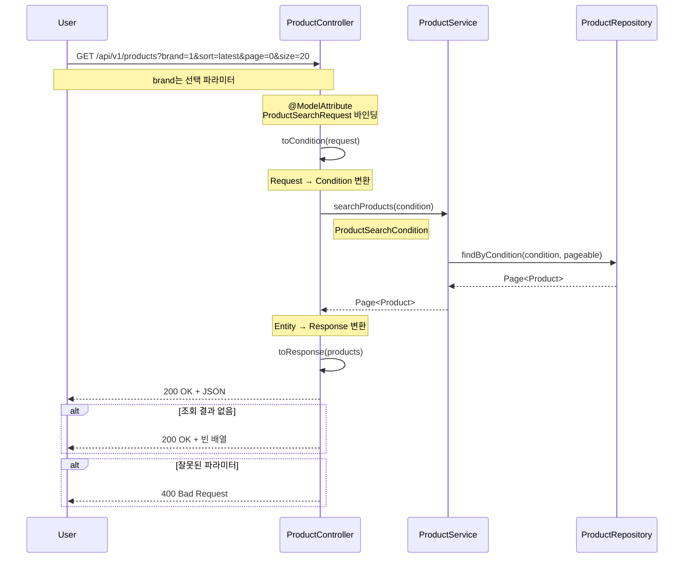

# 시퀀스 다이어그램

## 상품 목록 조회

```mermaid
sequenceDiagram
    participant User
    participant ProductController
    participant ProductService
    participant ProductRepository

    User->>ProductController: GET /api/v1/products?brand=1&sort=latest&page=0&size=20
    Note over User,ProductController: brand는 선택 파라미터
    
    Note over ProductController: @ModelAttribute<br/>ProductSearchRequest 바인딩
    ProductController->>ProductController: toCondition(request)
    Note over ProductController: Request → Condition 변환
    
    ProductController->>ProductService: searchProducts(condition)
    Note right of ProductController: ProductSearchCondition
    
    ProductService->>ProductRepository: findByCondition(condition, pageable)
    ProductRepository-->>ProductService: Page<Product>
    ProductService-->>ProductController: Page<Product>
    
    Note over ProductController: Entity → Response 변환
    ProductController->>ProductController: toResponse(products)
    ProductController-->>User: 200 OK + JSON
    
    alt 조회 결과 없음
        ProductController-->>User: 200 OK + 빈 배열
    end
    
    alt 잘못된 파라미터
        ProductController-->>User: 400 Bad Request
    end
```