# 시퀀스 다이어그램

## 👤 사용자 (User)

### 회원가입

### 내 정보 조회

```mermaid
sequenceDiagram
    participant Client
    participant UserV1Api
    participant UserQueryService
    participant UserRepository

    Client->>UserV1Api: GET /api/v1/users/{userIdentifier}
    UserV1Api->>UserQueryService: getUserByIdentifier(userIdentifier)
    UserQueryService->>UserRepository: findByIdentifier(userIdentifier)

    alt 사용자가 존재하지 않는 경우
        UserRepository-->>UserQueryService: Empty
        UserQueryService-->>UserV1Api: Exception (사용자 없음)
        UserV1Api-->>Client: 404 Not Found
    else 사용자가 존재하는 경우
        UserRepository-->>UserQueryService: User
        UserQueryService-->>UserV1Api: User
        UserV1Api-->>Client: 200 OK
    end
```

---

## 💰 포인트 (Point)

### 포인트 충전

```mermaid
sequenceDiagram
    participant Client
    participant UserV1Api
    participant UserPointService
    participant UserRepository
    participant UserPointRepository

    Client->>UserV1Api: POST /api/v1/users/points/charge (amount)
    UserV1Api->>UserPointService: chargePoint(userIdentifier, amount)
    UserPointService->>UserRepository: exists(userIdentifier)

    alt 사용자가 존재하지 않는 경우
        UserRepository-->>UserPointService: false
        UserPointService-->>UserV1Api: Exception (사용자 없음)
        UserV1Api-->>Client: 404 Not Found
    else 사용자가 존재하는 경우
        UserRepository-->>UserPointService: true
        UserPointService->>UserPointRepository: findByUserIdentifier(userIdentifier)
        UserPointRepository-->>UserPointService: UserPoint

        alt 충전 금액이 음수인 경우
            UserPointService-->>UserV1Api: Exception (금액 오류)
            UserV1Api-->>Client: 400 Bad Request
        else 충전 금액이 양수인 경우
            UserPointService->>UserPointService: 현재 포인트 + 충전 금액
            UserPointService->>UserPointRepository: save(updatedPoint)
            UserPointRepository-->>UserPointService: UserPoint
            UserPointService-->>UserV1Api: UserPoint
            UserV1Api-->>Client: 200 OK
        end
    end
```

### 보유 포인트 조회

```mermaid
sequenceDiagram
    participant Client
    participant UserV1Api
    participant UserPointService
    participant UserRepository
    participant UserPointRepository

    Client->>UserV1Api: GET /api/v1/users/points
    UserV1Api->>UserPointService: getByUserIdentifier(userIdentifier)
    UserPointService->>UserRepository: exists(userIdentifier)

    alt 사용자가 존재하지 않는 경우
        UserRepository-->>UserPointService: false
        UserPointService-->>UserV1Api: Exception (사용자 없음)
        UserV1Api-->>Client: 404 Not Found
    else 사용자가 존재하는 경우
        UserRepository-->>UserPointService: true
        UserPointService->>UserPointRepository: findByUserIdentifier(userIdentifier)
        UserPointRepository-->>UserPointService: UserPoint
        UserPointService-->>UserV1Api: UserPoint
        UserV1Api-->>Client: 200 OK
    end
```

---

## 🏷 브랜드 & 상품 (Brand & Product)

### 브랜드 정보 조회

```mermaid
sequenceDiagram
    participant Client
    participant BrandV1Api
    participant BrandService
    participant BrandRepository

    Client->>BrandV1Api: GET /api/v1/brands/{brandId}
    BrandV1Api->>BrandService: getBrand(brandId)
    BrandService->>BrandRepository: findById(brandId)

    alt 브랜드가 존재하지 않는 경우
        BrandRepository-->>BrandService: Empty
        BrandService-->>BrandV1Api: Exception (브랜드 없음)
        BrandV1Api-->>Client: 404 Not Found
    else 브랜드가 존재하는 경우
        BrandRepository-->>BrandService: Brand
        BrandService-->>BrandV1Api: Brand
        BrandV1Api-->>Client: 200 OK
    end
```

### 상품 목록 조회

### 상품 정보 조회

```mermaid
sequenceDiagram
    participant Client
    participant ProductV1Api
    participant ProductService
    participant ProductRepository

    Client->>ProductV1Api: GET /api/v1/products/{productId}
    ProductV1Api->>ProductService: getProduct(productId)
    ProductService->>ProductRepository: findById(productId)

    alt 상품이 존재하지 않는 경우
        ProductRepository-->>ProductService: Empty
        ProductService-->>ProductV1Api: Exception (상품 없음)
        ProductV1Api-->>Client: 404 Not Found
    else 상품이 존재하는 경우
        ProductRepository-->>ProductService: Product
        ProductService-->>ProductV1Api: Product
        ProductV1Api-->>Client: 200 OK
    end
```

---

## ❤️ 좋아요 (Like)

### 상품 좋아요 등록

```mermaid
sequenceDiagram
    participant Client
    participant ProductLikeV1Api
    participant ProductLikeService
    participant ProductRepository
    participant ProductLikeRepository

    Client->>ProductLikeV1Api: POST /api/v1/like/products/{productId} (userId)
    ProductLikeV1Api->>ProductLikeService: addLike(userId, productId)
    ProductLikeService->>ProductRepository: exists(productId)

    alt 상품이 존재하지 않는 경우
        ProductRepository-->>ProductLikeService: false
        ProductLikeService-->>ProductLikeV1Api: Exception (상품 없음)
        ProductLikeV1Api-->>Client: 404 Not Found
    else 상품이 존재하는 경우
        ProductRepository-->>ProductLikeService: true
        ProductLikeService->>ProductLikeRepository: exists(userId, productId)

        alt 이미 좋아요를 누른 경우
            ProductLikeRepository-->>ProductLikeService: true
            ProductLikeService-->>ProductLikeV1Api: Success (이미 좋아요함)
            ProductLikeV1Api-->>Client: 200 OK
        else 좋아요를 누르지 않은 경우
            ProductLikeRepository-->>ProductLikeService: false
            ProductLikeService->>ProductLikeRepository: save(productLike)
            ProductLikeRepository-->>ProductLikeService: ProductLike
            ProductLikeService->>ProductRepository: increaseLikeCount(productId)
            ProductRepository-->>ProductLikeService: Product
            ProductLikeService-->>ProductLikeV1Api: ProductLike
            ProductLikeV1Api-->>Client: 200 Ok
        end
    end
```

### 상품 좋아요 취소

### 내가 좋아요 한 상품 목록 조회

---

## 🧾 주문 / 결제 (Order & Payment)

### 주문 요청

```mermaid
sequenceDiagram
    participant Client
    participant OrderV1Api
    participant OrderService
    participant UserPointRepository
    participant ProductRepository
    participant OrderRepository
    participant PaymentRepository

    Client->>OrderV1Api: POST /api/v1/orders (userId, productId, quantity)
    OrderV1Api->>OrderService: createOrder(userId, productId, quantity)
    OrderService->>UserPointRepository: findByUserId(userId)

    alt 사용자 포인트 조회 실패
        UserPointRepository-->>OrderService: Empty
        OrderService-->>OrderV1Api: Exception (포인트 없음)
        OrderV1Api-->>Client: 404 Not Found
    else 사용자 포인트 조회 성공
        UserPointRepository-->>OrderService: UserPoint
        OrderService->>ProductRepository: findById(productId)

        alt 상품이 존재하지 않는 경우
            ProductRepository-->>OrderService: Empty
            OrderService-->>OrderV1Api: Exception (상품 없음)
            OrderV1Api-->>Client: 404 Not Found
        else 상품이 존재하는 경우
            ProductRepository-->>OrderService: Product
            OrderService->>OrderService: payAmount = product.price * quantity
            OrderService->>OrderService: 포인트 >= 총 가격 확인

            alt 포인트가 부족한 경우
                OrderService-->>OrderV1Api: Exception (포인트 부족)
                OrderV1Api-->>Client: 400 Bad Request
            else 포인트가 충분한 경우
                OrderService->>OrderService: 재고 >= 주문 수량 확인

                alt 재고가 부족한 경우
                    OrderService-->>OrderV1Api: Exception (재고 부족)
                    OrderV1Api-->>Client: 400 Bad Request
                else 재고가 충분한 경우
                    OrderService->>OrderRepository: save(order)
                    OrderRepository-->>OrderService: Order
                    OrderService->>ProductRepository: decreaseStock(productId, quantity)
                    ProductRepository-->>OrderService: Product
                    OrderService->>UserPointRepository: deductPoint(userId, payAmount)
                    UserPointRepository-->>OrderService: UserPoint
                    OrderService->>PaymentRepository: save(payment)
                    PaymentRepository-->>OrderService: Payment
                    OrderService-->>OrderV1Api: Order
                    OrderV1Api-->>Client: 200 Ok
                end
            end
        end
    end
```

### 유저의 주문 목록 조회

### 단일 주문 상세 조회

```mermaid
sequenceDiagram
    participant Client
    participant OrderV1Api
    participant OrderService
    participant OrderRepository
    participant PaymentRepository

    Client->>OrderV1Api: GET /api/v1/orders/{orderId}
    OrderV1Api->>OrderService: getOrder(orderId)
    OrderService->>OrderRepository: findById(orderId)

    alt 주문이 존재하지 않는 경우
        OrderRepository-->>OrderService: Empty
        OrderService-->>OrderV1Api: Exception (주문 없음)
        OrderV1Api-->>Client: 404 Not Found
    else 주문이 존재하는 경우
        OrderRepository-->>OrderService: Order
        OrderService->>PaymentRepository: findByOrderId(orderId)
        PaymentRepository-->>OrderService: Payment
        OrderService-->>OrderV1Api: OrderDetail
        OrderV1Api-->>Client: 200 OK
    end
```

