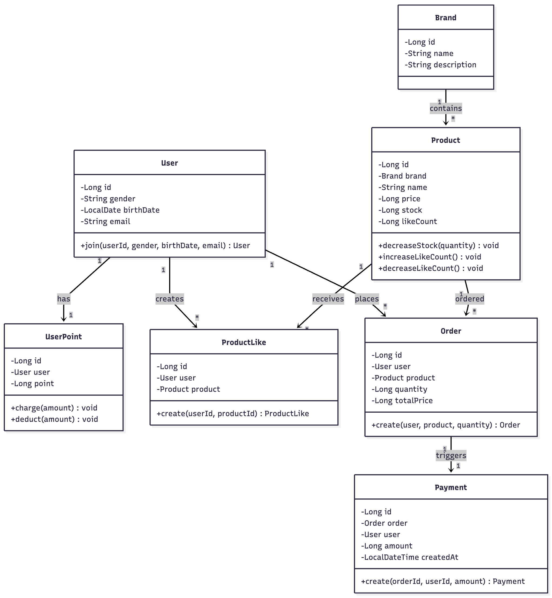
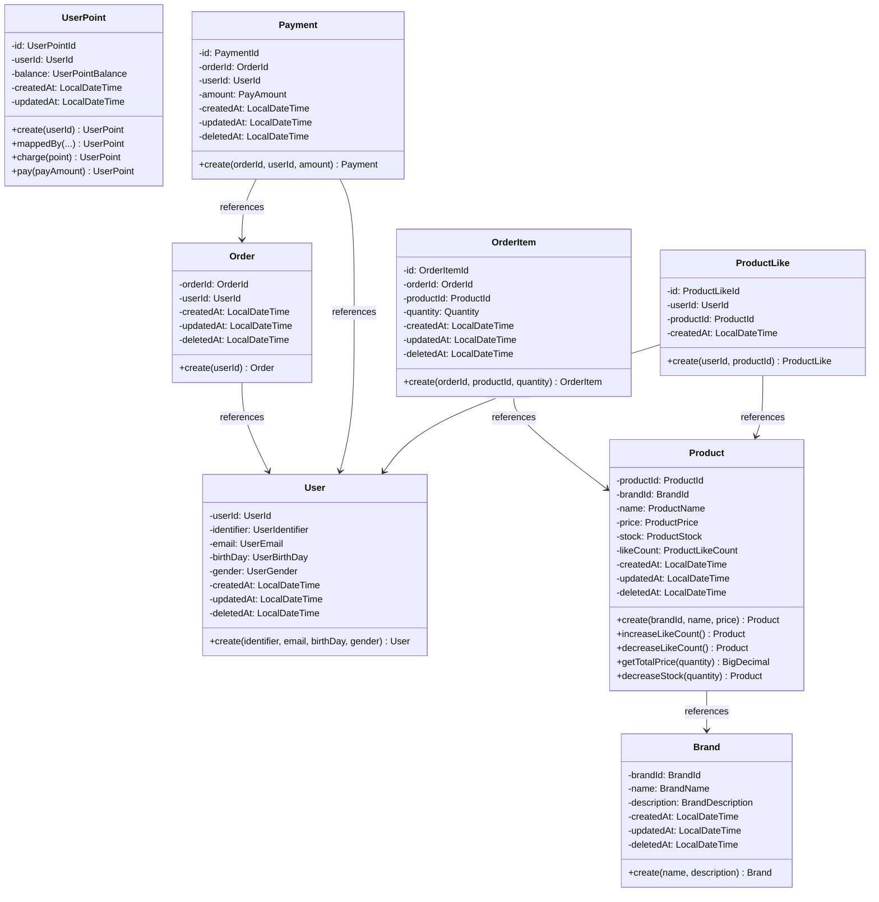

# 클래스 다이어그램

## 클래스 관계도

## 각 클래스의 책임

### User Context

#### User

- **책임**: 사용자의 기본 정보를 관리하고 회원가입/정보 조회 처리
- **속성**:
    - `userId`: 사용자 고유 ID
    - `identifier`: 로그인 ID
    - `email`: 이메일 (정규표현식 검증)
    - `birthDay`: 생년월일
    - `gender`: 성별 (MALE, FEMALE)
    - `createdAt`: LocalDateTime (생성 시간)
    - `updatedAt`: LocalDateTime (수정 시간)
    - `deletedAt`: LocalDateTime (삭제 시간, Soft Delete)
- **메서드**:
    - `create(identifier, email, birthDay, gender)`: 새로운 사용자 등록

#### UserPoint

- **책임**: 사용자의 포인트 잔액을 관리하고 포인트 거래 처리
- **속성**:
    - `id`: 포인트 기록 ID
    - `userId`: 사용자 ID
    - `balance`: 포인트 잔액 (BigDecimal, 정밀도 보장)
    - `createdAt`: LocalDateTime (생성 시간)
    - `updatedAt`: LocalDateTime (수정 시간)
- **메서드**:
    - `create(userId)`: 사용자의 포인트 초기화 (0포인트)
    - `charge(point)`: 포인트 충전
    - `pay(payAmount)`: 포인트로 결제

---

### Brand Context

#### Brand

- **책임**: 브랜드의 정보를 관리
- **속성**:
    - `brandId`: 브랜드 고유 ID
    - `name`: 브랜드명
    - `description`: 브랜드 설명
    - `createdAt`: LocalDateTime (생성 시간)
    - `updatedAt`: LocalDateTime (수정 시간)
    - `deletedAt`: LocalDateTime (삭제 시간, Soft Delete)
- **메서드**:
    - `create(name, description)`: 새 브랜드 생성

---

### Product Context

#### Product

- **책임**: 상품의 기본 정보와 상태(재고, 좋아요 수)를 관리하고 비즈니스 규칙 검증
- **속성**:
    - `productId`: 상품 고유 ID
    - `brandId`: 브랜드 ID
    - `name`: 상품명
    - `price`: 상품 가격 (BigDecimal, 정밀도 보장)
    - `stock`: 상품 재고
    - `likeCount`: 좋아요 수
    - `createdAt`: LocalDateTime (생성 시간)
    - `updatedAt`: LocalDateTime (수정 시간)
    - `deletedAt`: LocalDateTime (삭제 시간, Soft Delete)
- **메서드**:
    - `create(brandId, name, price)`: 새 상품 생성
    - `getTotalPrice(quantity)`: 수량별 총 가격 계산
    - `decreaseStock(quantity)`: 주문 시 재고 감소 (재고 부족 시 예외)
    - `increaseLikeCount()`: 좋아요 추가
    - `decreaseLikeCount()`: 좋아요 취소

---

### Order Context

#### Order

- **책임**: 사용자의 주문 정보를 관리하고 주문 항목을 소유
- **속성**:
    - `orderId`: 주문 고유 ID
    - `userId`: 사용자 ID
    - `createdAt`: LocalDateTime (생성 시간)
    - `updatedAt`: LocalDateTime (수정 시간)
    - `deletedAt`: LocalDateTime (삭제 시간, Soft Delete)
- **메서드**:
    - `create(userId)`: 새로운 주문 생성
- **관계**: Order가 OrderItem의 생명주기를 관리하는 Aggregate Root

#### OrderItem

- **책임**: 주문 내 개별 상품 정보를 관리 (Order에 종속)
- **속성**:
    - `id`: 주문 항목 고유 ID
    - `orderId`: 주문 ID
    - `productId`: 상품 ID
    - `quantity`: 주문 수량
    - `createdAt`: LocalDateTime (생성 시간)
    - `updatedAt`: LocalDateTime (수정 시간)
    - `deletedAt`: LocalDateTime (삭제 시간, Soft Delete)
- **메서드**:
    - `create(orderId, productId, quantity)`: 주문 항목 생성
- **특징**: Order 없이 독립적으로 조회 불가

---

### Payment Context

#### Payment

- **책임**: 주문에 따른 결제 정보를 기록하고 관리
- **속성**:
    - `id`: 결제 고유 ID
    - `orderId`: 주문 ID
    - `userId`: 사용자 ID
    - `amount`: 결제 금액 (BigDecimal, 정밀도 보장)
    - `createdAt`: LocalDateTime (생성 시간)
    - `updatedAt`: LocalDateTime (수정 시간)
    - `deletedAt`: LocalDateTime (삭제 시간, Soft Delete)
- **메서드**:
    - `create(orderId, userId, amount)`: 새 결제 기록 생성
- **특징**: 결제는 일회성 이벤트이므로 저장만 지원

---

### ProductLike Context

#### ProductLike (상품 좋아요 - Aggregate Root)

- **책임**: 사용자와 상품 간의 좋아요 관계를 관리 (다대다 관계)
- **속성**:
    - `id`: 좋아요 기록 고유 ID
    - `userId`: 사용자 ID (FK)
    - `productId`: 상품 ID (FK)
    - `createdAt`: LocalDateTime (좋아요 생성 시간)
- **메서드**:
    - `create(userId, productId)`: 좋아요 생성
- **특징**: DeletedAt 없음 (직접 삭제, Product.likeCount에 영향)
