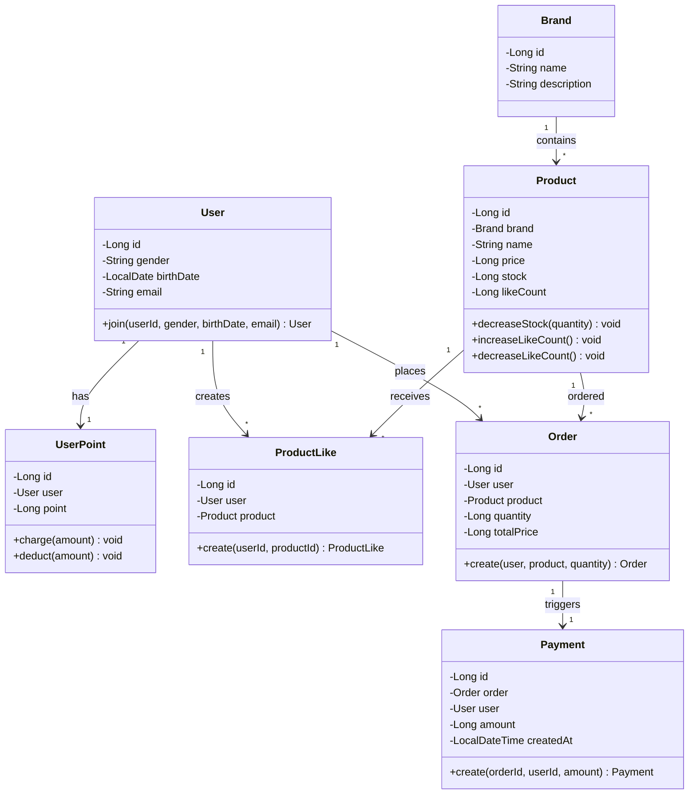

# 클래스 다이어그램

## 클래스 관계도

## 각 클래스의 책임

### User (사용자)

- **책임**: 사용자의 기본 정보를 관리하고 회원가입/정보 조회 처리
- **속성**: id, gender, birthDate, email
- **메서드**:
    - `joinUser()`: 새로운 사용자 등록

### UserPoint (포인트)

- **책임**: 사용자의 포인트 잔액을 관리
- **속성**: userId, point
- **메서드**:
    - `charge()`: 포인트 충전
    - `deduct()`: 포인트 차감 (주문 시)
    - `isEnoughPoint(amount)` : 충분한 포인트가 있는지 확인

### Brand (브랜드)

- **책임**: 브랜드의 정보를 관리
- **속성**: brandId, name, description

### Product (상품)

- **책임**: 상품의 기본 정보와 상태(재고, 좋아요 수)를 관리
- **속성**: productId, brandId, name, price, stock, likeCount
- **메서드**:
    - `decreaseStock()`: 주문 시 재고 감소
    - `increaseLikeCount()`: 좋아요 추가 시 카운트 증가
    - `decreaseLikeCount()`: 좋아요 취소 시 카운트 감소
    - `hasEnoughStock()` : 충분한 재고가 있는지 확인

### ProductLike (상품 좋아요)

- **책임**: 사용자와 상품 간의 좋아요 관계를 관리
- **속성**: userId, productId, createdAt
- **메서드**:
    - `create()`: 좋아요 생성

### Order (주문)

- **책임**: 사용자의 주문 정보를 관리
- **속성**: orderId, userId, productId, quantity, totalPrice, createdAt
- **메서드**:
    - `create()`: 새로운 주문 생성

### Payment (결제)

- **책임**: 주문에 따른 결제 정보를 기록하고 관리
- **속성**: paymentId, orderId, userId, amount, createdAt
- **메서드**:
    - `create()`: 결제 생성

## 클래스 간 관계

| 관계                    | 설명                             |
|-----------------------|--------------------------------|
| User - UserPoint      | 일대일: 각 사용자는 하나의 포인트 계정을 가짐     |
| User - ProductLike    | 일대다: 사용자는 여러 상품에 좋아요 가능        |
| User - Order          | 일대다: 사용자는 여러 주문 가능             |
| Product - ProductLike | 일대다: 상품은 여러 사용자로부터 좋아요 받을 수 있음 |
| Product - Order       | 일대다: 상품은 여러 주문에 포함될 수 있음       |
| Brand - Product       | 일대다: 하나의 브랜드는 여러 상품을 제공        |
| Order - Payment       | 일대일: 각 주문은 하나의 결제 정보를 가짐       |
