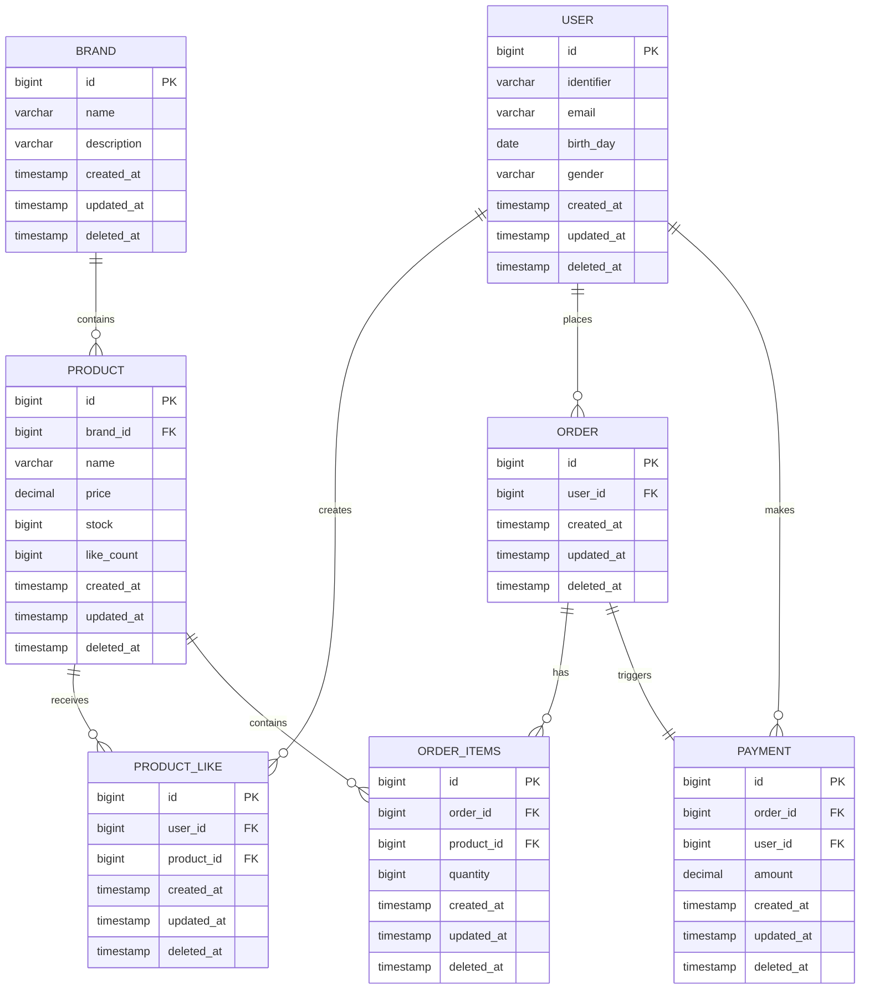

# 엔티티 관계도 (ERD)

## ERD

## 관계 설명

| 관계                       | 카디널리티 | 설명                                |
|---------------------------|-------|-----------------------------------|
| BRAND → PRODUCT           | 1:N   | 하나의 브랜드는 여러 상품을 가짐              |
| USER → PRODUCT_LIKE       | 1:N   | 사용자는 여러 상품에 좋아요 가능              |
| PRODUCT → PRODUCT_LIKE    | 1:N   | 상품은 여러 사용자로부터 좋아요 받을 수 있음     |
| USER → ORDER              | 1:N   | 사용자는 여러 주문 가능                   |
| ORDER → ORDER_ITEMS       | 1:N   | 하나의 주문은 여러 주문 항목을 가짐            |
| PRODUCT → ORDER_ITEMS     | 1:N   | 상품은 여러 주문 항목에 포함될 수 있음         |
| ORDER → PAYMENT           | 1:1   | 각 주문은 하나의 결제 정보를 가짐             |
| USER → PAYMENT            | 1:N   | 사용자는 여러 결제를 할 수 있음              |

