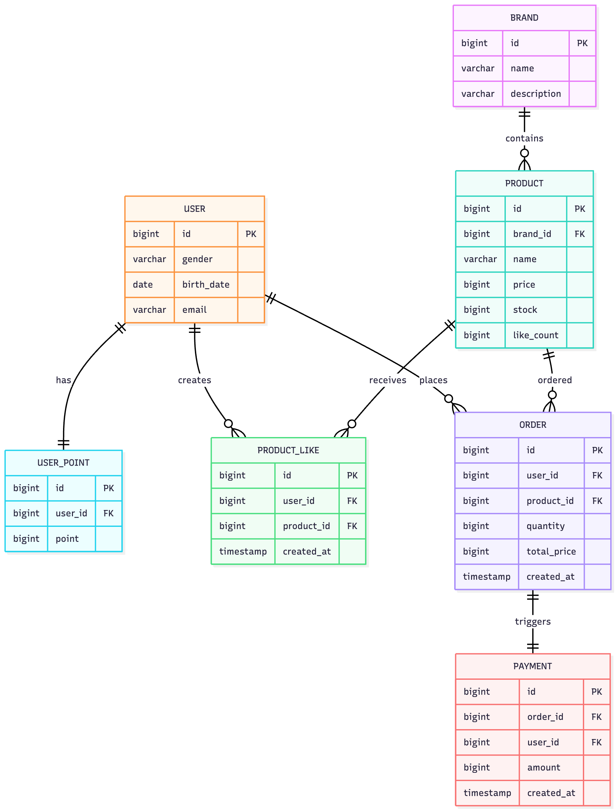
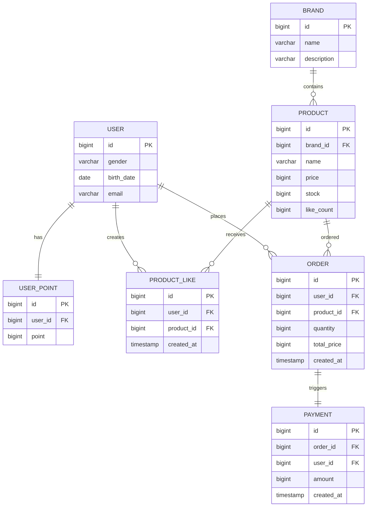

# 엔티티 관계도 (ERD)

## ERD

## 관계 설명

| 관계                     | 카디널리티 | 설명                        |
|------------------------|-------|---------------------------|
| BRAND → PRODUCT        | 1:N   | 하나의 브랜드는 여러 상품을 가짐        |
| USER → USER_POINT      | 1:1   | 각 사용자는 하나의 포인트 계정을 가짐     |
| USER → PRODUCT_LIKE    | 1:N   | 사용자는 여러 상품에 좋아요 가능        |
| PRODUCT → PRODUCT_LIKE | 1:N   | 상품은 여러 사용자로부터 좋아요 받을 수 있음 |
| USER → ORDER           | 1:N   | 사용자는 여러 주문 가능             |
| PRODUCT → ORDER        | 1:N   | 상품은 여러 주문에 포함될 수 있음       |
| ORDER → PAYMENT        | 1:1   | 각 주문은 하나의 결제 정보를 가짐       |

