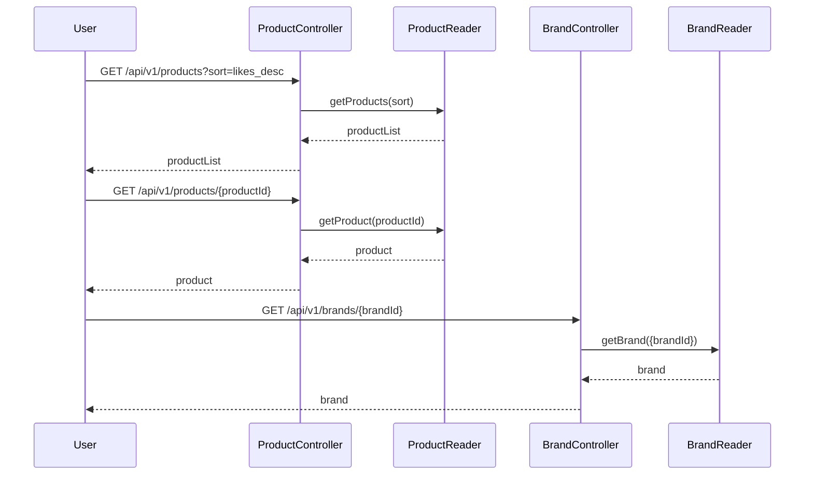

### 1. 상품 목록/상세 조회 및 브랜드 조회

### 2. 주문 생성

```mermaid
sequenceDiagram
    participant User
    participant OrderController
    participant OrderService
    participant ProductReader
    participant PointReader
    participant ProductService
    participant PointService
    participant OrderRepository

    User->>OrderController: POST /api/v1/orders (body: {productId, quantity})
    OrderController->>OrderService: createOrder(userId, {productId, quantity})

    %% 조회 및 검증 (서버가 가격/포인트 확인) %%
    OrderService->>ProductReader: getProduct({productId})
    ProductReader -->>OrderService: product(현재가격, 재고)

    OrderService->>PointReader: getPoint(userId)
    PointReader-->>OrderService: point (현재 잔여 포인트)
    
    %% 서버가 totalPrice를 직접 계산하는 로직 명시 %%
    Note right of OrderService: 3. 서버가 totalPrice를 직접 계산<br/>(product.getPrice() * quantity)

    %% 재고 및 포인트 차감 (계산된 totalPrice 사용) %%
    critical Transaction Block
        OrderService ->>ProductService: decreaseStock(productId, quantity)
        OrderService ->>PointService: deductPoint(calculatedTotalPrice)
        OrderService->> OrderRepository: save(new Order(..., calculatedTotalPrice))
        OrderRepository-->>OrderService: orderInfo
    end

    %% 응답 %%
    OrderService -->> OrderController:orderInfo
    OrderController-->> User:orderInfo
    ```