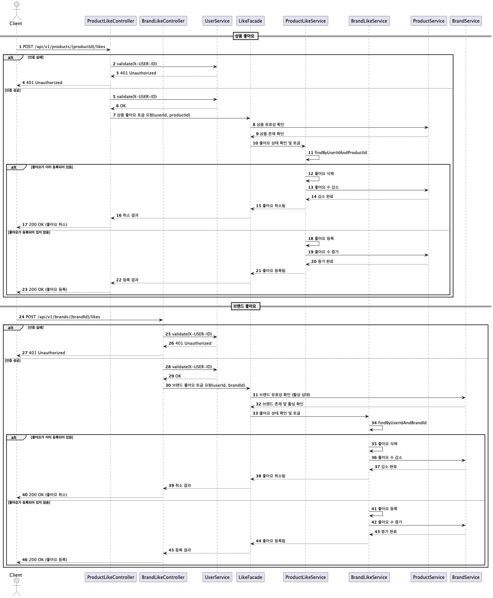

# Sequence Diagrams

이 문서는 시스템의 주요 플로우를 나타내는 시퀀스 다이어그램들을 정리합니다.

## 1. Order and Payment Flow
주문 및 결제 처리 플로우

[시퀀스 다이어그램 소스](sequence/OrderAndPaymentFlow.puml)

## 2. Payment Callback
결제 콜백 처리

[시퀀스 다이어그램 소스](sequence/PaymentCallBack.puml)

## 3. Product List
상품 목록 조회

[시퀀스 다이어그램 소스](sequence/getProductList.puml)

## 4. Like
좋아요 기능

[시퀀스 다이어그램 소스](sequence/like.puml)