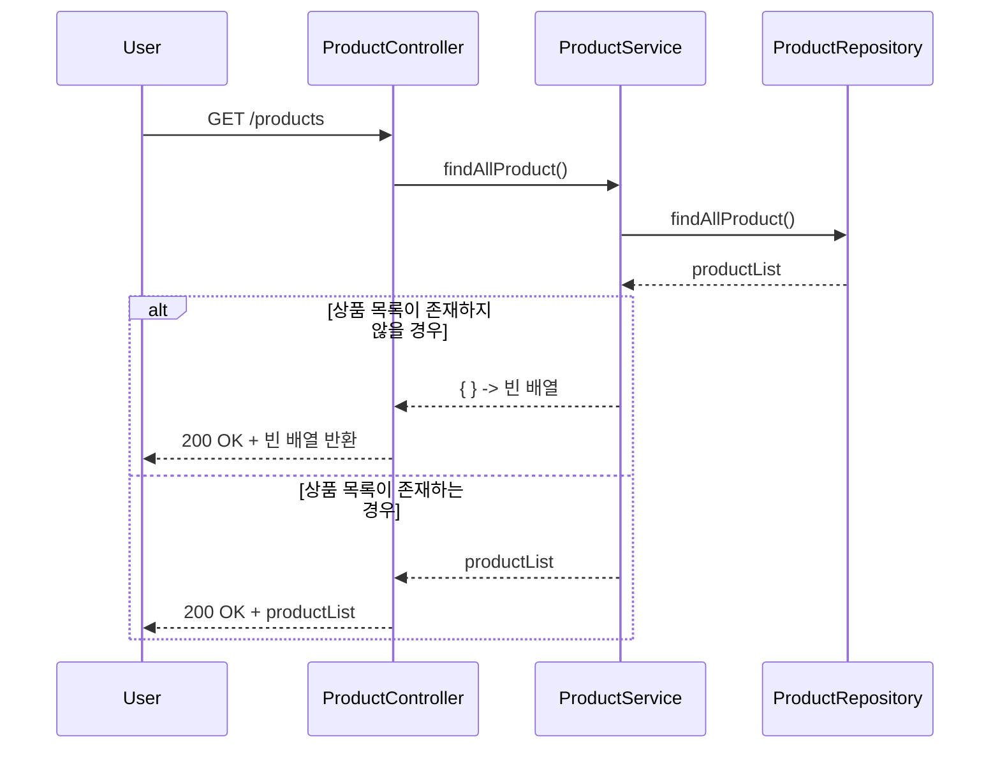
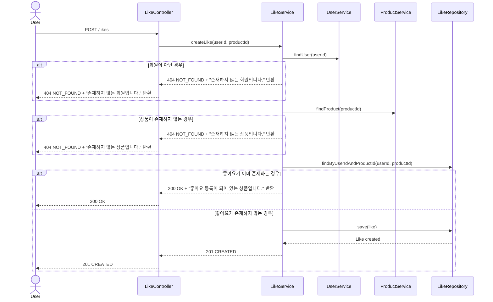
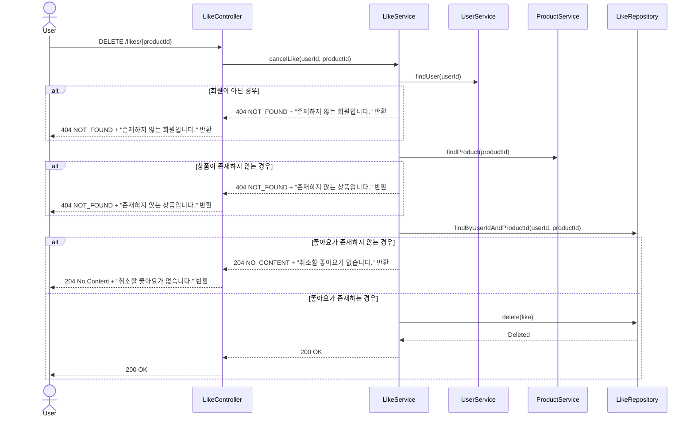

# 시퀀스 다이어그램

> 상품 목록 조회
>

```mermaid
sequenceDiagram
	participant User
	participant ProductController
	participant ProductService
	participant ProductRepository

	User->>ProductController: GET /products
	ProductController->>ProductService: findAllProduct()
	ProductService->>ProductRepository: findAllProduct()
	ProductRepository-->>ProductService: productList

  alt 상품 목록이 존재하지 않을 경우
      ProductService-->>ProductController: { } -> 빈 배열
      ProductController-->>User: 200 OK + 빈 배열 반환
  else 상품 목록이 존재하는 경우
      ProductService-->>ProductController: productList
      ProductController-->>User: 200 OK + productList	
end
```

> 상품 좋아요 등록 (멱등 동작)
>

```mermaid
sequenceDiagram
	actor User
	participant LikeController
	participant LikeService
	participant UserService
	participant ProductService
	participant LikeRepository

	User->>LikeController: POST /likes
	LikeController->>LikeService: createLike(userId, productId)
	
	%% 사용자 검증
	LikeService->>UserService: findUser(userId)
	alt 회원이 아닌 경우
			LikeService-->>LikeController: 404 NOT_FOUND + "존재하지 않는 회원입니다." 반환
			LikeController-->>User: 404 NOT_FOUND + "존재하지 않는 회원입니다." 반환
			
	end
	
	%% 상품 검증
	LikeService->>ProductService: findProduct(productId)
	alt 상품이 존재하지 않는 경우
			LikeService-->> LikeController: 404 NOT_FOUND + "존재하지 않는 상품입니다." 반환
			LikeController-->> User: 404 NOT_FOUND + "존재하지 않는 상품입니다." 반환
	end
	
	%% 좋아요 존재 여부 확인
	LikeService->>LikeRepository: findByUserIdAndProductId(userId, productId)
	alt 좋아요가 이미 존재하는 경우
			LikeService-->> LikeController: 200 OK + "좋아요 등록이 되어 있는 상품입니다." 반환
			LikeController-->> User: 200 OK
	else 좋아요가 존재하지 않는 경우
			LikeService->>LikeRepository: save(like)
			LikeRepository-->>LikeService: Like created
			LikeService-->>LikeController: 201 CREATED
			LikeController-->>User: 201 CREATED
			
	end
	
```

> 상품 좋아요 취소 (멱등 동작)
>

```mermaid
sequenceDiagram
    actor User
    participant LikeController
    participant LikeService
    participant UserService
    participant ProductService
    participant LikeRepository

    User->>LikeController: DELETE /likes/{productId}
    LikeController->>LikeService: cancelLike(userId, productId)
    
    %% 사용자 검증
		LikeService->>UserService: findUser(userId)
		alt 회원이 아닌 경우
				LikeService-->>LikeController: 404 NOT_FOUND + "존재하지 않는 회원입니다." 반환
				LikeController-->>User: 404 NOT_FOUND + "존재하지 않는 회원입니다." 반환
				
		end
	
		%% 상품 검증
		LikeService->>ProductService: findProduct(productId)
		alt 상품이 존재하지 않는 경우
				LikeService-->> LikeController: 404 NOT_FOUND + "존재하지 않는 상품입니다." 반환
				LikeController-->> User: 404 NOT_FOUND + "존재하지 않는 상품입니다." 반환
		end

    LikeService->>LikeRepository: findByUserIdAndProductId(userId, productId)
    alt 좋아요가 존재하지 않는 경우
        LikeService-->>LikeController: 204 NO_CONTENT + "취소할 좋아요가 없습니다." 반환
        LikeController-->>User: 204 No Content + "취소할 좋아요가 없습니다." 반환
    else 좋아요가 존재하는 경우
        LikeService->>LikeRepository: delete(like)
        LikeRepository-->>LikeService: Deleted
        LikeService-->>LikeController: 200 OK
        LikeController-->>User: 200 OK
    end

```