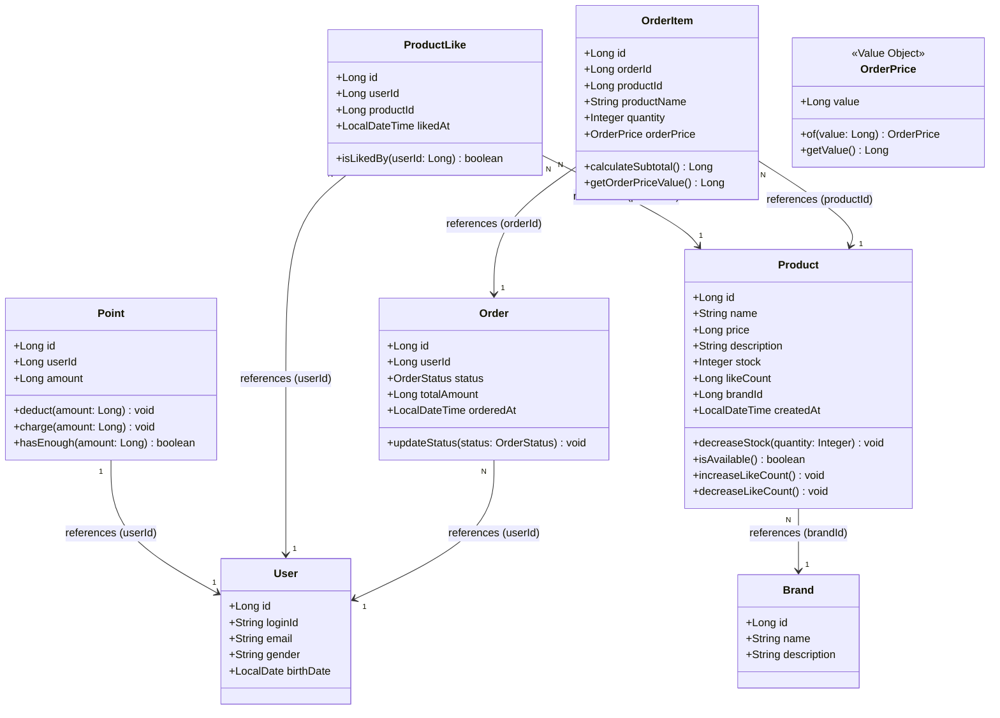
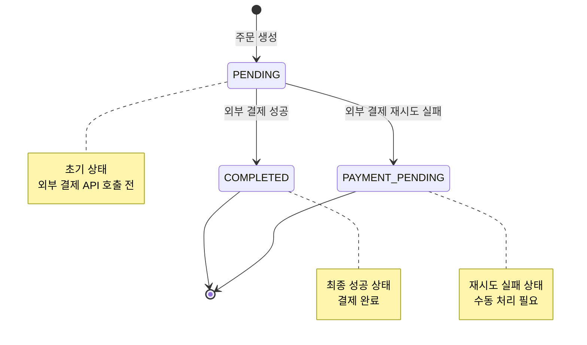
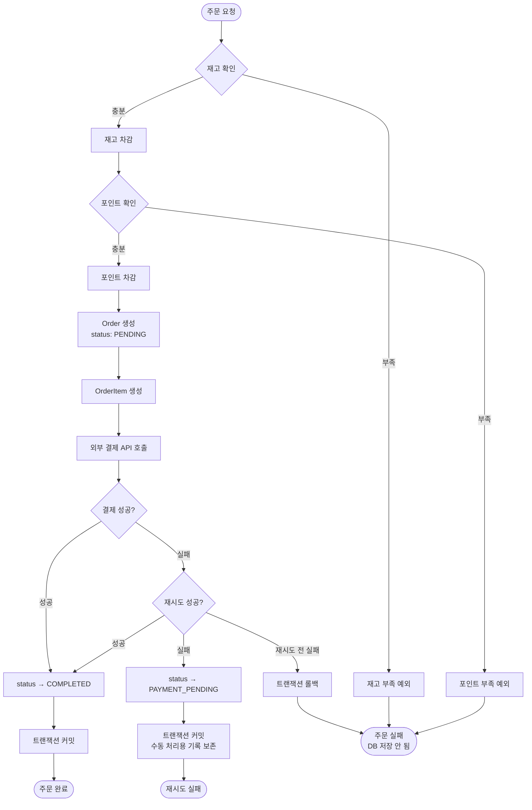

# 03-class-diagram.md - 클래스 다이어그램

## 📑 목차

- [1. 도메인 객체 설계](#1-도메인-객체-설계)
- [2. 도메인 설명](#2-도메인-설명)
  - [2.1 User (사용자)](#21-user-사용자)
  - [2.2 Point (포인트)](#22-point-포인트)
  - [2.3 Product (상품)](#23-product-상품)
  - [2.4 Brand (브랜드)](#24-brand-브랜드)
  - [2.5 ProductLike (좋아요)](#25-productlike-좋아요)
  - [2.6 Order (주문)](#26-order-주문)
  - [2.7 OrderItem (주문 항목)](#27-orderitem-주문-항목)
  - [2.8 OrderPrice (주문 가격)](#28-orderprice-주문-가격)
- [3. 관계 설명](#3-관계-설명)
- [4. Order 상태 다이어그램](#4-order-상태-다이어그램)
- [5. 참고사항](#5-참고사항)

---

## 1. 도메인 객체 설계

## 2. 도메인 설명

### 2.1 User (사용자)
- 회원 정보를 담는 엔티티
- 좋아요와 주문의 주인

### 2.2 Point (포인트)
- 사용자의 포인트 잔액
- User 1명당 Point 1개 (1:1 관계)
- **비즈니스 로직**:
  - `deduct()`: 포인트 차감 (부족 시 예외)
  - `charge()`: 포인트 충전
  - `hasEnough()`: 잔액 충분 여부 확인

### 2.3 Product (상품)
- 판매 상품 정보
- 재고, 가격, 브랜드 정보를 가짐
- `likeCount`: 좋아요 수 (비정규화된 집계 값, 성능 최적화용)
- **비즈니스 로직**:
  - `decreaseStock()`: 재고 차감 (부족 시 예외)
  - `isAvailable()`: 판매 가능 여부 (재고 > 0)
  - `increaseLikeCount()`, `decreaseLikeCount()`: 좋아요 수 관리

### 2.4 Brand (브랜드)
- 브랜드 정보
- 여러 상품을 포함함

### 2.5 ProductLike (좋아요)
- 사용자가 상품에 누른 좋아요
- 한 상품당 한 번만 좋아요 가능 (중복 방지)
- `likedAt`: 좋아요 누른 시각 (최근 순 정렬용)
- **비즈니스 로직**:
  - `isLikedBy()`: 특정 사용자가 좋아요했는지 확인

### 2.6 Order (주문)
- 사용자의 주문 정보
- `status`: 주문 상태 (OrderStatus Enum: PENDING, COMPLETED, PAYMENT_PENDING)
- `totalAmount`: 주문 총액 (OrderItem 금액 합계)
- `orderedAt`: 주문한 시각
- **비즈니스 로직**:
  - `updateStatus()`: 주문 상태 변경 (결제 실패 시 PAYMENT_PENDING으로 변경)
- **주문 항목 조회**: OrderItemRepository를 통해 `findByOrderId()`로 조회
- **상태 다이어그램**: [4. Order 상태 다이어그램](#4-order-상태-다이어그램) 참고

### 2.7 OrderItem (주문 항목)
- 주문에 포함된 개별 상품
- **스냅샷 저장**: 주문 당시의 상품명, 가격, 수량을 저장하여 Product 변동에 영향받지 않음
  - `productName`: 주문 시점 상품명 (Product 삭제 시에도 주문 내역 표시 가능)
  - `orderPrice`: 주문 시점 가격 (OrderPrice Value Object, Product 가격 변동과 무관)
  - `quantity`: 주문 수량
- **Entity로 설계**: 독립 테이블로 관리되며 향후 확장 가능
- **비즈니스 로직**:
  - `calculateSubtotal()`: 항목 소계 (orderPrice × quantity)
  - `getOrderPriceValue()`: 주문 가격 값 조회

### 2.8 OrderPrice (주문 가격)
- **Value Object**: 주문 시점의 가격 스냅샷
- Product의 Money와 별도 타입으로 스냅샷 의도 명확화
- **불변성**: 생성 후 변경 불가
- **검증**: null 방지, 음수 방지

## 3. 관계 설명

| 관계 | 유형 | 설명 |
|------|------|------|
| **Point → User** | 1:1 (ID 참조) | 사용자 1명당 포인트 1개, `userId` 필드로 참조 |
| **Product → Brand** | N:1 (ID 참조) | 여러 상품이 하나의 브랜드 소속, `brandId` 필드로 참조 |
| **ProductLike → User** | N:1 (ID 참조) | 사용자가 여러 상품에 좋아요 가능, `userId` 필드로 참조 |
| **ProductLike → Product** | N:1 (ID 참조) | 상품 하나에 여러 좋아요 가능, `productId` 필드로 참조 |
| **Order → User** | N:1 (ID 참조) | 사용자가 여러 주문 가능, `userId` 필드로 참조 |
| **OrderItem → Order** | N:1 (ID 참조) | 주문 항목이 주문 참조, `orderId` 필드로 참조 |
| **OrderItem → Product** | N:1 (ID 참조) | 주문 항목이 상품 참조, `productId` 필드로 참조 |

### 참조 방식
- 참조 컬럼명: `ref_` 접두사 사용 (예: `ref_user_id`, `ref_order_id`)

## 4. Order 상태 다이어그램

### 4.1 상태 정의

| 상태 | 설명 | 비고 |
|------|------|------|
| **PENDING** | 주문 생성 완료 | 외부 결제 API 호출 전 초기 상태 |
| **COMPLETED** | 결제 완료 | 외부 결제 API 성공 시 최종 상태 |
| **PAYMENT_PENDING** | 결제 재시도 실패 | 외부 결제 실패 후 재시도 실패 시 |

**참고**: `FAILED` 상태는 존재하지 않음
- 이유: 결제 실패 시 트랜잭션 롤백으로 주문 데이터가 DB에 저장되지 않음
- 재시도 실패한 주문만 `PAYMENT_PENDING` 상태로 DB에 저장됨

### 4.2 상태 전이 다이어그램

### 4.3 상태 전이 조건

| 전이 | 조건 | 동작 |
|------|------|------|
| `[*] → PENDING` | 주문 생성 요청 | 1. 재고 확인 및 차감 2. 포인트 차감 3. Order, OrderItem 생성 (status: PENDING) |
| `PENDING → COMPLETED` | 외부 결제 API 성공 | 1. Order.status를 COMPLETED로 업데이트 2. 트랜잭션 커밋 |
| `PENDING → PAYMENT_PENDING` | 외부 결제 재시도 실패 | 1. Order.status를 PAYMENT_PENDING으로 업데이트 2. 트랜잭션 커밋 (수동 처리 위해 주문 기록 보존) |
| `PENDING → [트랜잭션 롤백]` | 외부 결제 실패 (재시도 전) | 1. 전체 트랜잭션 롤백 2. DB에 주문 데이터 저장 안 됨 |

### 4.4 주문 처리 흐름도

### 4.5 상태별 비즈니스 규칙

#### PENDING
- **허용 동작**:
  - 외부 결제 API 호출
  - 상태 변경 → COMPLETED (결제 성공)
  - 상태 변경 → PAYMENT_PENDING (재시도 실패)
- **제약 사항**:
  - 사용자에게 주문 상세 조회 시 "결제 처리 중" 표시
  - 이 상태의 주문은 재고/포인트 이미 차감된 상태

#### COMPLETED
- **허용 동작**:
  - 주문 조회 (주문 목록, 상세)
- **제약 사항**:
  - 더 이상 상태 변경 불가 (최종 상태)
  - 취소/환불 기능은 현재 요구사항에 없음

#### PAYMENT_PENDING
- **허용 동작**:
  - 관리자 수동 처리
  - 주문 조회
- **제약 사항**:
  - 자동 재시도 불가 (이미 재시도 실패한 상태)
  - 수동 처리 필요 (환불 또는 결제 재처리)

## 5. 참고사항

- User, Point는 1주차에서 이미 구현됨 (관계 표현 위해 포함)
- **공통 필드** (BaseEntity 상속):
  - `id`: 엔티티 식별자 (Long)
  - `createdAt`: 생성 일시
  - `updatedAt`: 수정 일시
  - `deletedAt`: 삭제 일시 (Soft Delete용)
