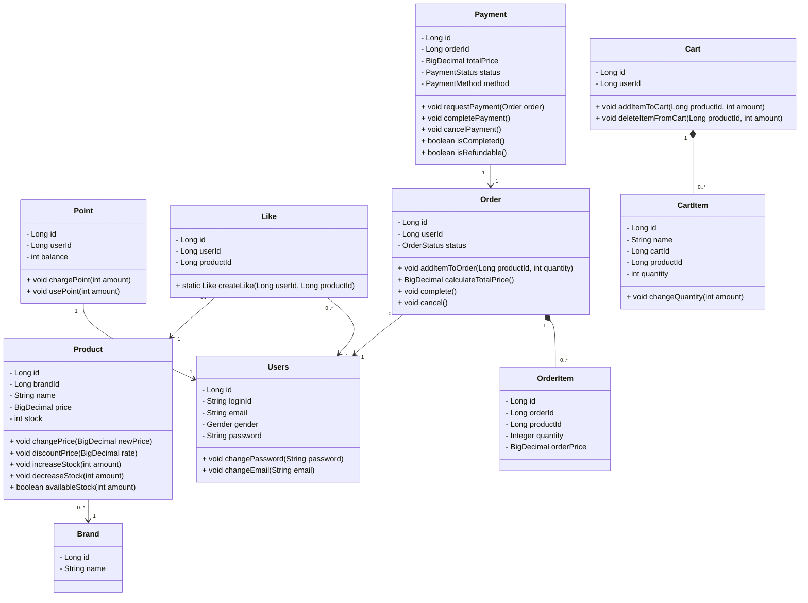

# 클래스 다이어그램

```mermaid
classDiagram
	class Users {
		- Long id
		- String loginId
		- String email
		- Gender gender
		- String password
		
		+ void changePassword(String password)
		+ void changeEmail(String email)
	}
	
	class Point {
		- Long id
		- Long userId
		- int balance
		
		+ void chargePoint(int amount)
		+ void usePoint(int amount)	
	}
	
	class Brand {
    - Long id
    - String name
    
  }
	
  class Product {
    - Long id
    - Long brandId
    - String name
    - BigDecimal price
    - int stock
    
    + void changePrice(BigDecimal newPrice)
    + void discountPrice(BigDecimal rate)
    + void increaseStock(int amount)
    + void decreaseStock(int amount)
    + boolean availableStock(int amount)
    
  }
  
  class Like {
	  - Long id
	  - Long userId
	  - Long productId
		
	  + static Like createLike(Long userId, Long productId)
		
  }
  
	class Cart {
	  - Long id
	  - Long userId
	  
	  + void addItemToCart(Long productId, int amount)
	  + void deleteItemFromCart(Long productId, int amount)
  }

  class CartItem {
	  - Long id
	  - String name
	  - Long cartId
	  - Long productId
	  - int quantity
		
		+ void changeQuantity(int amount)
  }
  
  class Order {
	  - Long id
	  - Long userId
	  - OrderStatus status
	  
	  + void addItemToOrder(Long productId, int quantity)
	  + BigDecimal calculateTotalPrice()
	  + void complete()
	  + void cancel()
	  
  }
  
  class OrderItem {
	  - Long id
	  - Long orderId
	  - Long productId
	  - Integer quantity
	  - BigDecimal orderPrice
  }
  
  class Payment {
	  - Long id
	  - Long orderId
	  - BigDecimal totalPrice
	  - PaymentStatus status
	  - PaymentMethod method
	  
	  + void requestPayment(Order order)
	  + void completePayment()
	  + void cancelPayment()
	  + boolean isCompleted()
	  + boolean isRefundable()
  }
  
  Order "1" *-- "0..*" OrderItem
  Cart "1" *-- "0..*" CartItem
  Product "0..*" --> "1" Brand
  Like "0..*" --> "1" Users
  Like "0..*" --> "1" Product
  Order "0..*" --> "1" Users
  Point "1" --> "1" Users
  Payment "1" --> "1" Order
```