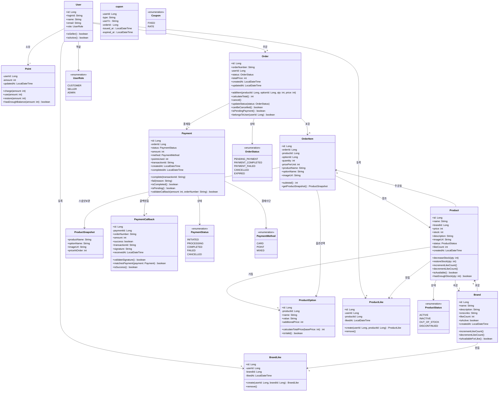

# 클래스 다이어그램 (도메인 중심 설계)

> 시퀀스 다이어그램 분석을 통해 도출된 도메인 클래스들의 최소 스펙

---

## 설계 원칙

### 1. 시퀀스 다이어그램 기반 설계
- **OrderAndPaymentFlow**: 주문/결제 분리에 따른 상태 관리
- **PaymentCallback**: 콜백 검증 및 실패 처리 로직
- **Like**: 상품/브랜드 좋아요 토글 기능 (멱등성)
- **Cancel**: 주문 취소 시 리소스 복구 메서드

### 2. 도메인 규칙 반영
- **Point**: 결제 완료 시점 차감, 취소 시 복구
- **Product**: 재고 관리 (차감/복구), 상태별 주문 가능 여부
- **Order**: 사용자 권한 검증, 상태별 취소 가능 여부
- **Payment**: 콜백 검증, 중복 처리 방지

### 3. 멱등성 보장
- **Like 엔티티**: 중복 등록/취소 무시
- **PaymentCallback**: 중복 콜백 처리 방지
- **Order 취소**: 이미 취소된 주문 재처리 방지

### 4. 데이터 일관성
- **ProductSnapshot**: 주문 시점 상품 정보 보존
- **Point 복구**: 주문 취소 시 사용된 포인트 원복
- **Stock 복구**: 주문 취소 시 차감된 재고 원복
