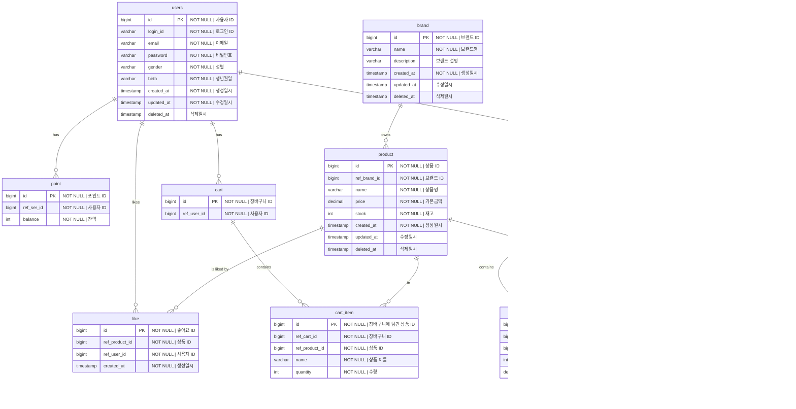

# ERD

```mermaid
erDiagram
    users {
        bigint id PK "NOT NULL | 사용자 ID"
        varchar login_id "NOT NULL | 로그인 ID"
        varchar email "NOT NULL | 이메일"
        varchar password "NOT NULL | 비밀번호"
        varchar gender "NOT NULL | 성별"
        varchar birth "NOT NULL | 생년월일"
        timestamp created_at "NOT NULL | 생성일시"
        timestamp updated_at "NOT NULL | 수정일시"
        timestamp deleted_at "삭제일시"
    }

    point {
        bigint id PK "NOT NULL | 포인트 ID"
        bigint ref_ser_id "NOT NULL | 사용자 ID"
        int balance "NOT NULL | 잔액"
    }

    brand {
        bigint id PK "NOT NULL | 브랜드 ID"
        varchar name "NOT NULL | 브랜드명"
        varchar description "브랜드 설명"
        timestamp created_at "NOT NULL | 생성일시"
        timestamp updated_at "수정일시"
        timestamp deleted_at "삭제일시"
    }

    product {
        bigint id PK "NOT NULL | 상품 ID"
        bigint ref_brand_id "NOT NULL | 브랜드 ID"
        varchar name "NOT NULL | 상품명"
        decimal price "NOT NULL | 기본금액"
        int stock "NOT NULL | 재고"
        timestamp created_at "NOT NULL | 생성일시"
        timestamp updated_at "수정일시"
        timestamp deleted_at "삭제일시"
    }

	  like {
        bigint id PK "NOT NULL | 좋아요 ID"
        bigint ref_product_id "NOT NULL | 상품 ID"
        bigint ref_user_id "NOT NULL | 사용자 ID"
        timestamp created_at "NOT NULL | 생성일시"
    }
    
    cart {
		    bigint id PK "NOT NULL | 장바구니 ID"
		    bigint ref_user_id "NOT NULL | 사용자 ID"
		
		}
		
		cart_item {
				bigint id PK "NOT NULL | 장바구니에 담긴 상품 ID"
				bigint ref_cart_id "NOT NULL | 장바구니 ID"
				bigint ref_product_id "NOT NULL | 상품 ID"
				varchar name "NOT NULL | 상품 이름"
				int quantity "NOT NULL | 수량"
		}				

    order {
        bigint id PK "NOT NULL | 주문 ID"
        bigint ref_user_id "NOT NULL | 사용자 ID"
        decimal total_price "NOT NULL | 총 주문 금액"
        varchar status "NOT NULL | 주문 상태"
        timestamp created_at "NOT NULL | 주문 일시"
        timestamp updated_at "수정일시"
        timestamp deleted_at "삭제일시"
    }

    order_item {
        bigint id PK "NOT NULL | 주문 상품 ID"
        bigint ref_order_id "NOT NULL | 주문 ID"
        bigint ref_product_id "NOT NULL | 상품 ID"
        int quantity "NOT NULL | 수량"
        decimal price "NOT NULL | 금액"
    }

    payment {
				bigint id PK "NOT NULL | 결제 ID"
        bigint ref_order_id "NOT NULL | 주문 ID"
        decimal total_price "NOT NULL | 주문금액"
        varchar method "NOT NULL | 주문방법"
        varchar status "NOT NULL | 주문상태"
        timestamp created_at "생성일시"
        timestamp updated_at "수정일시"
        timestamp deleted_at "삭제일시"
        timestamp approved_at "결제 승인 일시"
    }

    users ||--o{ point : "has"
    users ||--o{ like : "likes"
    product ||--o{ like : "is liked by"
    brand ||--o{ product : "owns"
    users ||--o{ cart : "has"
    cart ||--o{ cart_item : "contains"
    product ||--o{ cart_item : "in"
    users ||--o{ order : "places"
    order ||--o{ order_item : "contains"
    product ||--o{ order_item : "included in"
    order ||--|| payment : "is paid by"
```