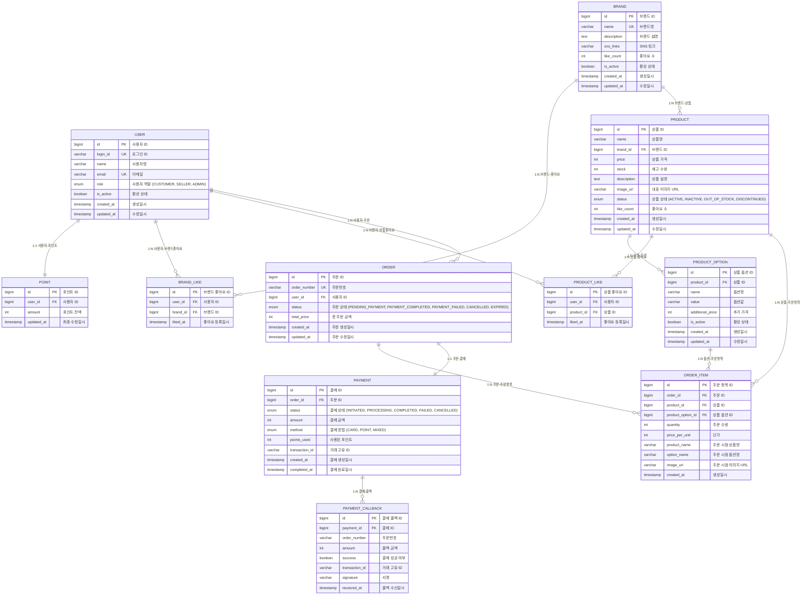

# ERD (Entity Relationship Diagram)

> 클래스 다이어그램을 기반으로 설계된 데이터베이스 스키마

---

## 데이터베이스 제약조건

### 1. Primary Keys
- 모든 테이블은 `id` 컬럼을 Primary Key로 사용
- `bigint` 타입의 자동 증가 값

### 2. Unique Constraints
- **USER**: `login_id`, `email` (중복 불가)
- **BRAND**: `name` (브랜드명 중복 불가)
- **ORDER**: `order_number` (주문번호 중복 불가)
- **BRAND_LIKE**: `(user_id, brand_id)` 복합 유니크
- **PRODUCT_LIKE**: `(user_id, product_id)` 복합 유니크

### 3. Foreign Key Constraints
- **CASCADE DELETE**: 사용자 삭제 시 관련 데이터 함께 삭제
- **RESTRICT DELETE**: 참조되는 데이터 삭제 시 오류 발생
- 모든 FK는 NOT NULL (참조 무결성 보장)

### 4. Check Constraints
- **POINT.amount**: `>= 0` (음수 포인트 불가)
- **PRODUCT.price**: `> 0` (가격은 양수)
- **PRODUCT.stock**: `>= 0` (재고는 0 이상)
- **ORDER.total_price**: `> 0` (주문 금액은 양수)
- **ORDER_ITEM.quantity**: `> 0` (수량은 양수)
- **PAYMENT.amount**: `> 0` (결제 금액은 양수)

### 5. Indexes
- **성능 최적화를 위한 인덱스**:
  - `USER(login_id)`, `USER(email)`
  - `PRODUCT(brand_id)`, `PRODUCT(status)`
  - `ORDER(user_id)`, `ORDER(status)`, `ORDER(created_at)`
  - `ORDER_ITEM(order_id)`, `ORDER_ITEM(product_id)`
  - `PAYMENT(order_id)`, `PAYMENT(status)`
  - `BRAND_LIKE(user_id, brand_id)`, `PRODUCT_LIKE(user_id, product_id)`

---

## 특수 설계 고려사항

### 1. 멱등성 보장
- **BRAND_LIKE**, **PRODUCT_LIKE**: 복합 유니크 키로 중복 방지
- **PAYMENT_CALLBACK**: 동일한 `transaction_id`로 중복 처리 방지

### 2. 데이터 일관성
- **ORDER_ITEM**: 주문 시점의 상품 정보 스냅샷 저장
- **POINT**: 결제 완료 시점에만 차감, 주문 취소 시 복구
- **PRODUCT.stock**: 결제 완료 시점에 차감, 주문 취소 시 복구

### 3. 성능 고려사항
- **like_count**: 비정규화로 조회 성능 향상
- **ORDER_ITEM**: 상품 정보 중복 저장으로 조회 성능 향상
- **적절한 인덱스**: 자주 사용되는 조회 패턴에 맞춘 인덱스 설계

### 4. 확장성 고려사항
- **PRODUCT_OPTION**: 다양한 옵션 타입 지원
- **PAYMENT_METHOD**: ENUM으로 새로운 결제 수단 추가 용이