# 02-sequence-diagrams.md - 시퀀스 다이어그램

## 📑 목차

### 상품 (Products)
- [1. 상품 목록 조회](#1-상품-목록-조회)
- [2. 상품 상세 조회 - 성공 플로우](#2-상품-상세-조회---성공-플로우)
- [3. 상품 상세 조회 - 에러 처리 (404)](#3-상품-상세-조회---에러-처리-404)

### 좋아요 (Likes)
- [4. 좋아요 기능 사용자 여정](#4-좋아요-기능-사용자-여정)
- [5. 상품 좋아요 등록](#5-상품-좋아요-등록)
- [6. 상품 좋아요 취소](#6-상품-좋아요-취소)
- [7. 좋아요 목록 조회](#7-좋아요-목록-조회)
- [8. 좋아요 에러 시나리오](#8-좋아요-에러-시나리오)

### 브랜드 (Brands)
- [9. 브랜드 조회](#9-브랜드-조회)

### 주문 (Orders)
- [10. 주문 생성 - 성공 플로우](#10-주문-생성---성공-플로우)
- [11. 주문 생성 - 실패 플로우](#11-주문-생성---실패-플로우)
- [12. 주문 목록 조회](#12-주문-목록-조회)
- [13. 주문 상세 조회](#13-주문-상세-조회)

---

## 1. 상품 목록 조회

### 플로우 설명

사용자가 상품 목록을 조회할 때의 흐름입니다. 브랜드 필터링, 정렬 조건, 페이지네이션을 지원하며, 각 상품의 좋아요 수와 현재 사용자의 좋아요 여부를 함께 반환합니다.

### 주요 처리 사항

- 상품 조회 및 페이지네이션 처리
- 사용자별 좋아요 상태 조회
- Product + LikeStatus 결합하여 응답 생성

### 다이어그램

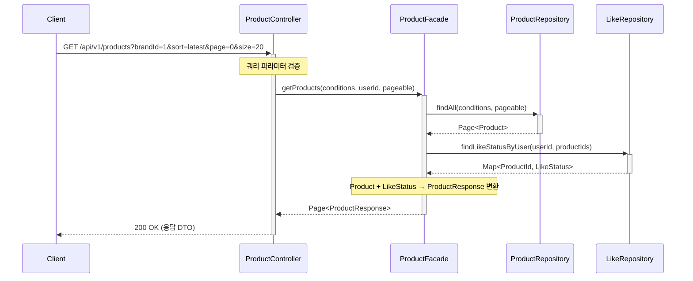

---

## 2. 상품 상세 조회 - 성공 플로우

### 플로우 설명

사용자가 특정 상품의 상세 정보를 조회할 때의 성공 흐름입니다. 상품 정보와 함께 현재 사용자의 좋아요 여부를 반환합니다.

### 주요 처리 사항

- 상품 ID로 상품 정보 조회
- 사용자의 좋아요 여부 확인
- 상품 상세 정보 응답 생성

### 다이어그램

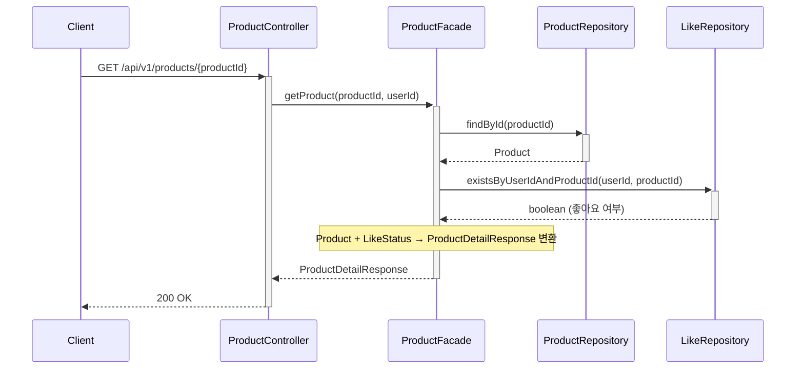

---

## 3. 상품 상세 조회 - 에러 처리 (404)

### 플로우 설명

존재하지 않는 상품을 조회할 때의 에러 처리 흐름입니다.

### 주요 처리 사항

- 상품 존재 여부 확인
- ProductNotFoundException 발생
- ExceptionHandler에서 404 응답 변환

### 다이어그램

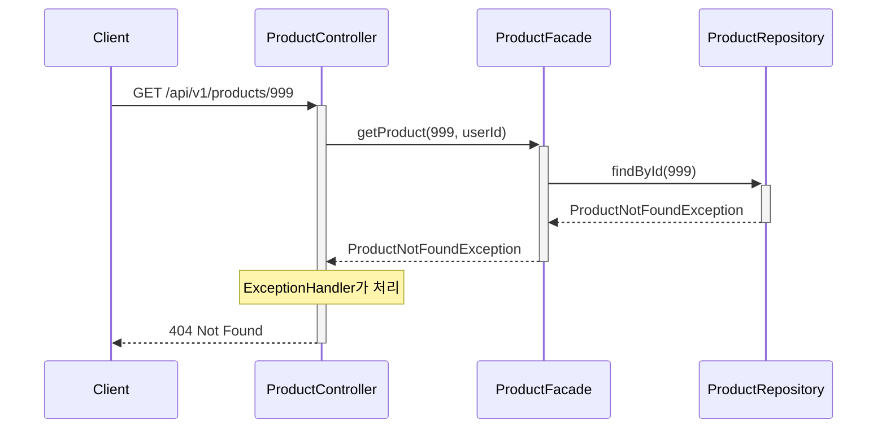

---

## 4. 좋아요 기능 사용자 여정

### 전체 시나리오

김철수가 좋아요 기능을 사용하는 완전한 여정:

1. **첫 좋아요 등록** → 마음에 드는 상품에 좋아요 클릭
2. **중복 등록 시도** → 실수로 다시 클릭해도 멱등성으로 정상 처리
3. **좋아요 취소** → 마음이 바뀌어 취소 버튼 클릭
4. **중복 취소 시도** → 이미 취소된 상태에서 재시도해도 멱등성으로 정상 처리
5. **재등록** → 다시 생각을 바꿔 좋아요 재등록
6. **좋아요 목록 확인** → 좋아요한 상품들을 한눈에 조회

이 여정을 통해 좋아요 기능의 **멱등성**(동일한 요청을 여러 번 해도 결과가 동일)이 어떻게 보장되는지 확인할 수 있습니다.

**관련 시퀀스**:
- [5. 상품 좋아요 등록](#5-상품-좋아요-등록)
- [6. 상품 좋아요 취소](#6-상품-좋아요-취소)
- [7. 좋아요 목록 조회](#7-좋아요-목록-조회)

---

## 5. 상품 좋아요 등록

### 플로우 설명

사용자가 상품에 좋아요를 등록할 때의 흐름입니다. 멱등성을 보장하기 위해 이미 좋아요가 등록되어 있으면 중복 등록하지 않고 정상 응답을 반환합니다.

### 주요 처리 사항

- 상품 존재 여부 확인
- 좋아요 중복 여부 확인
- 신규 등록 시 Like 도메인 객체 생성 및 저장
- **Product 테이블의 좋아요 수 증가 (like_count++)**
- 이미 존재 시 멱등성 보장 (중복 등록 무시)

### 다이어그램

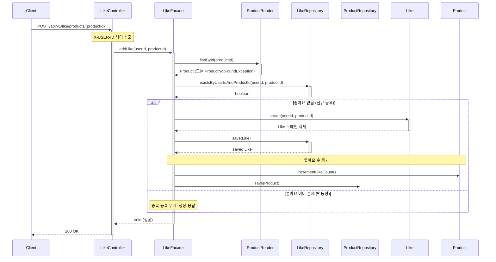

---

## 6. 상품 좋아요 취소

### 플로우 설명

사용자가 상품의 좋아요를 취소할 때의 흐름입니다. 멱등성을 보장하기 위해 이미 취소되어 있어도 정상 응답을 반환합니다.

### 주요 처리 사항

- 좋아요 존재 여부 확인
- 존재 시 삭제 처리
- **Product 테이블의 좋아요 수 감소 (like_count--)**
- 없을 시 멱등성 보장 (이미 취소됨)

### 다이어그램

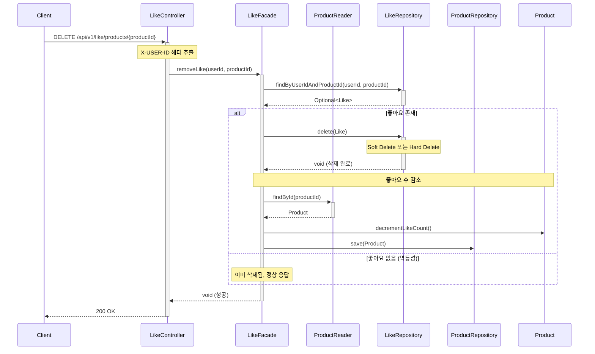

---

## 7. 좋아요 목록 조회

### 플로우 설명

사용자가 자신이 좋아요한 상품 목록을 조회할 때의 흐름입니다. 페이지네이션과 정렬을 지원하며, 각 상품의 기본 정보와 브랜드 정보를 함께 반환합니다.

### 주요 처리 사항

- 사용자의 좋아요 목록 조회
- 각 좋아요에 해당하는 상품 정보 조회
- Like + Product 결합하여 응답 생성

### 다이어그램

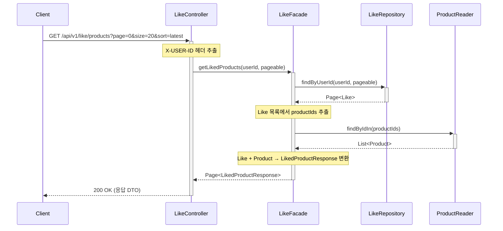

---

## 8. 좋아요 에러 시나리오

### 플로우 설명

좋아요 기능에서 발생할 수 있는 주요 에러 케이스입니다.

### 8.1 상품이 존재하지 않는 경우 (404)

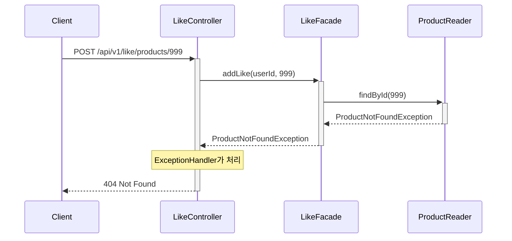

### 8.2 인증되지 않은 사용자 (401)

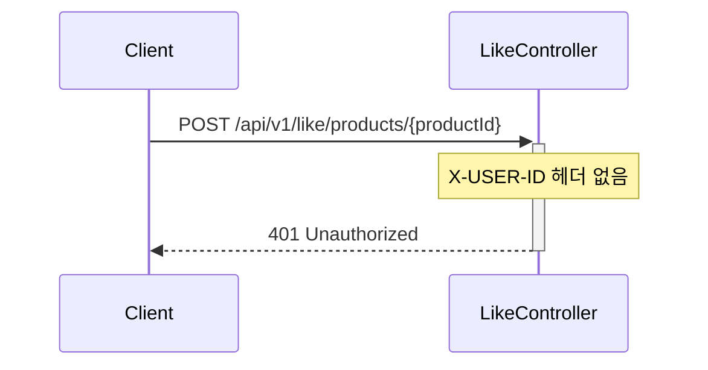

### 8.3 중복 좋아요 등록 시도 (멱등성 처리)

**플로우 설명**: 이미 좋아요한 상품에 다시 좋아요를 시도할 때, DB UNIQUE 제약 조건을 활용하여 멱등성을 보장하는 흐름입니다.

**주요 처리 사항**:
- DB UNIQUE(ref_user_id, ref_product_id) 제약으로 중복 방지
- 제약 위반 예외 발생 시 200 OK 응답으로 변환
- 동시 요청에도 데이터 일관성 보장

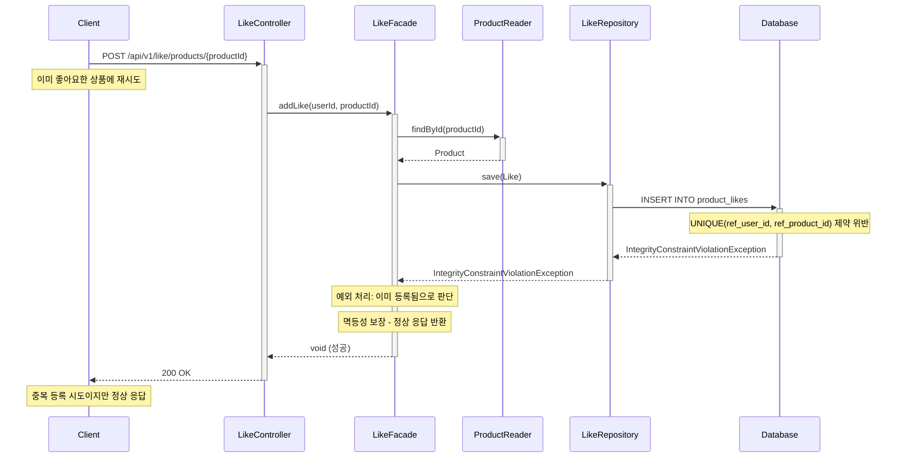

---

## 9. 브랜드 조회

### 플로우 설명

사용자가 특정 브랜드의 정보를 조회할 때의 흐름입니다. 브랜드 ID를 통해 브랜드명과 설명을 조회합니다.

### 주요 처리 사항

- 브랜드 ID로 브랜드 정보 조회
- 브랜드 존재 여부 확인
- 브랜드 정보 응답 생성

### 다이어그램

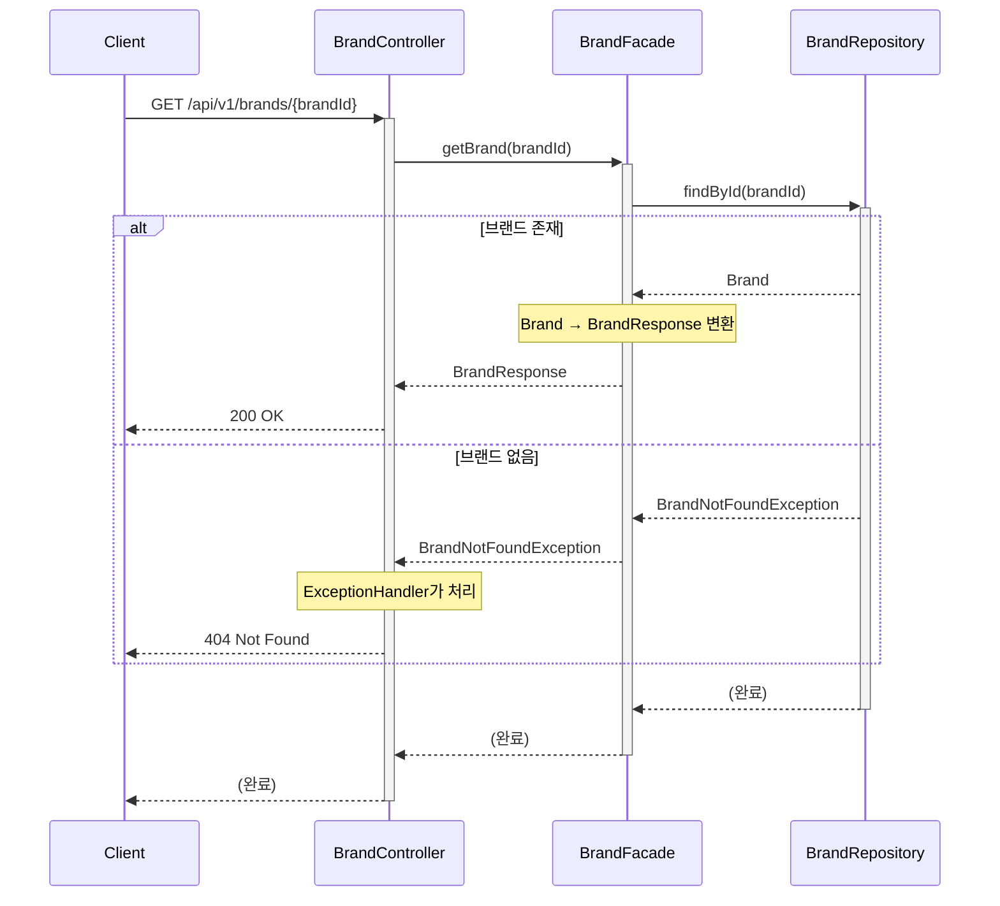

---

## 10. 주문 생성 - 성공 플로우

### 플로우 설명

사용자가 여러 상품을 주문하고 결제할 때의 성공 흐름입니다. 재고 확인, 포인트 확인, 재고 차감, 포인트 차감이 하나의 트랜잭션으로 처리됩니다.

### 주요 처리 사항

- 주문 상품별 재고 확인
- 총 결제 금액 계산
- 사용자 포인트 잔액 확인
- 재고 차감 및 주문 생성
- 포인트 차감
- 외부 시스템 전송 (Mock)

### 다이어그램

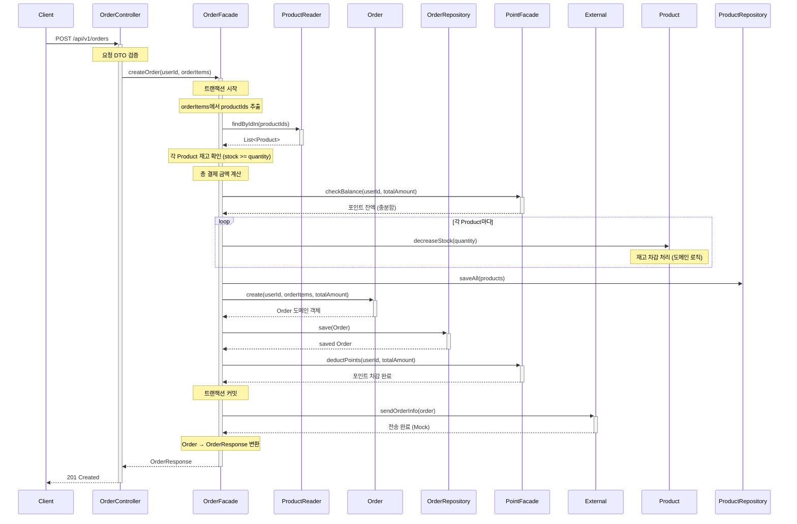

---

## 11. 주문 생성 - 실패 플로우

### 플로우 설명

주문 생성 시 재고 부족 또는 포인트 부족으로 실패하는 경우의 흐름입니다. 트랜잭션이 롤백되어 모든 변경사항이 취소됩니다.

### 11.1 재고 부족 케이스

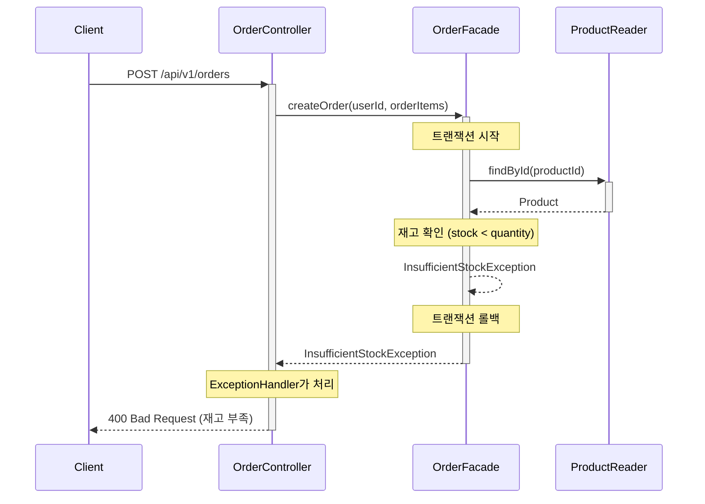

### 11.2 포인트 부족 케이스

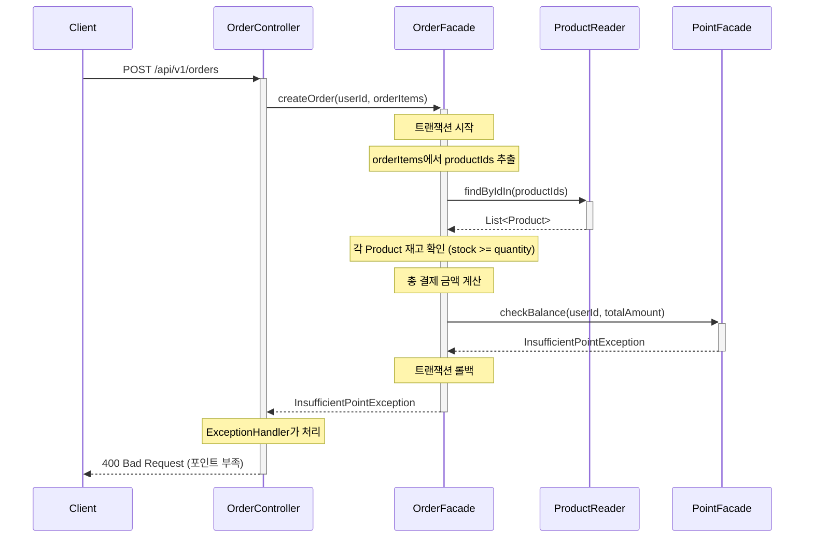

### 11.3 결제 처리 실패

**플로우 설명**: 주문 저장과 포인트 차감은 성공했으나, 외부 결제 시스템(Mock) 처리가 실패하는 경우입니다. 트랜잭션은 이미 커밋되었으므로 재시도 정책을 적용합니다.

**주요 처리 사항**:
- 트랜잭션 커밋 후 결제 시스템 호출 (트랜잭션 밖)
- 3회 자동 재시도 (1초, 2초, 4초 간격, 지수 백오프)
- 재시도 실패 시 주문 상태를 '결제 대기'로 마킹 및 500 에러 응답

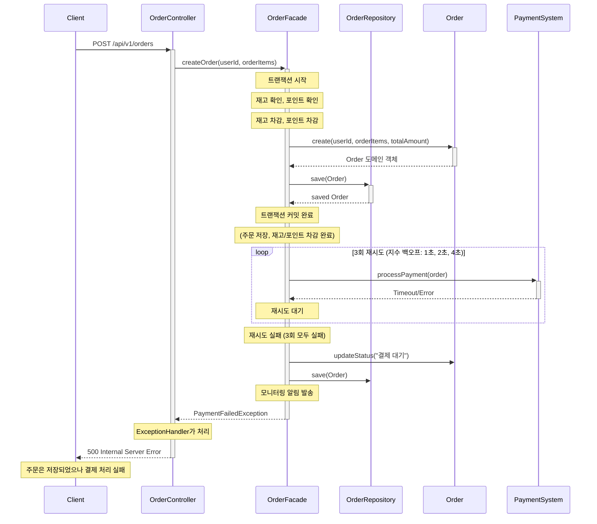

---

## 12. 주문 목록 조회

### 플로우 설명

사용자가 자신의 주문 목록을 조회할 때의 흐름입니다. 페이지네이션을 지원하며, 각 주문의 기본 정보(주문 ID, 일시, 총 금액, 상품 수)를 반환합니다.

### 주요 처리 사항

- 사용자별 주문 목록 조회
- 페이지네이션 처리
- 주문 기본 정보 응답 생성

### 다이어그램

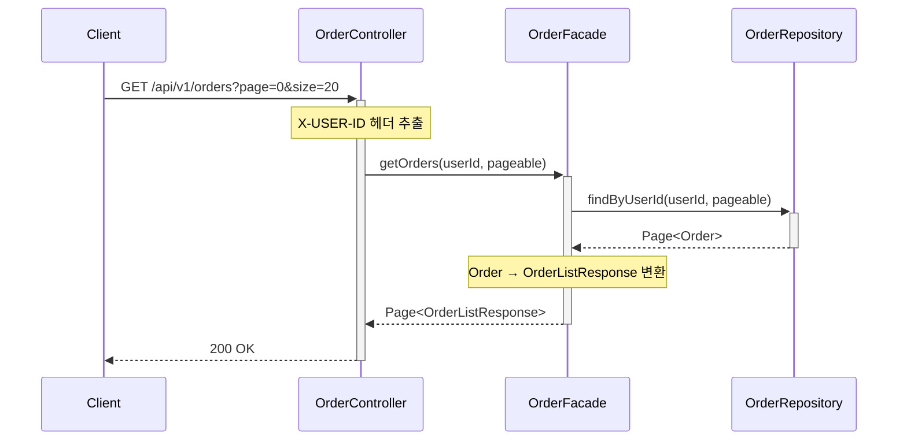

---

## 13. 주문 상세 조회

### 플로우 설명

사용자가 특정 주문의 상세 정보를 조회할 때의 흐름입니다. 주문 항목별 상품 정보와 가격을 포함한 전체 주문 정보를 반환합니다.

### 주요 처리 사항

- 주문 ID로 주문 정보 조회
- 주문 항목(OrderItem) 정보 포함
- 주문 상세 정보 응답 생성

### 다이어그램

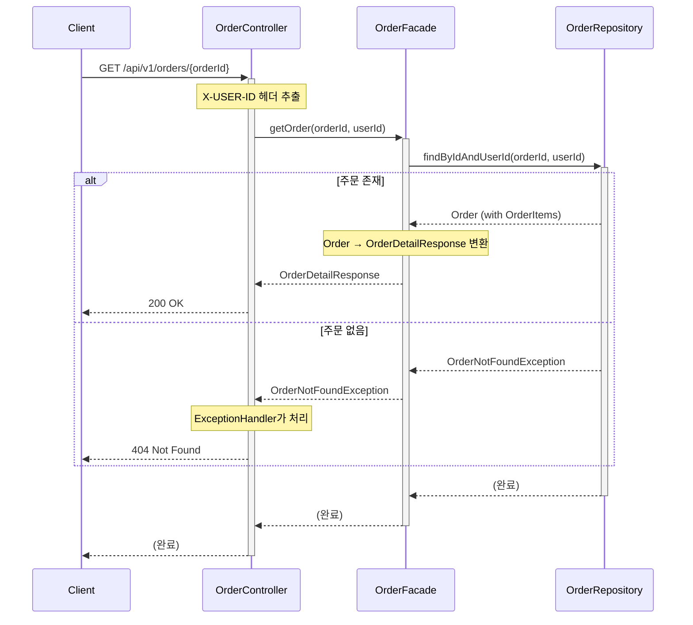
