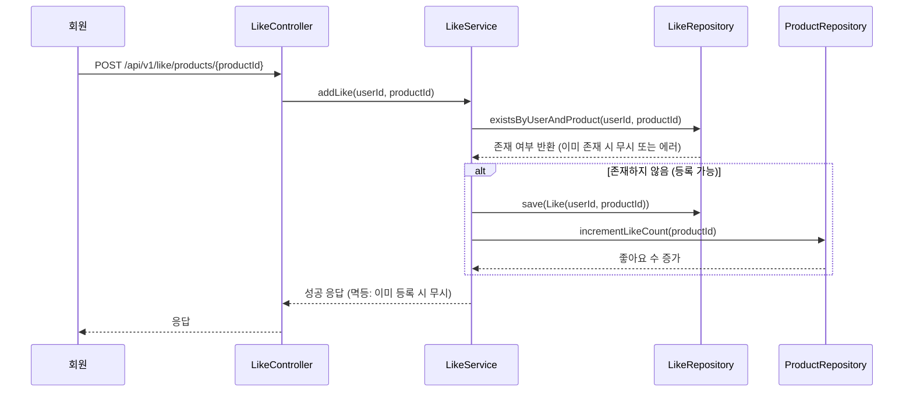
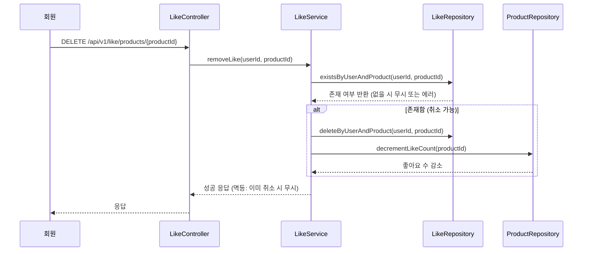
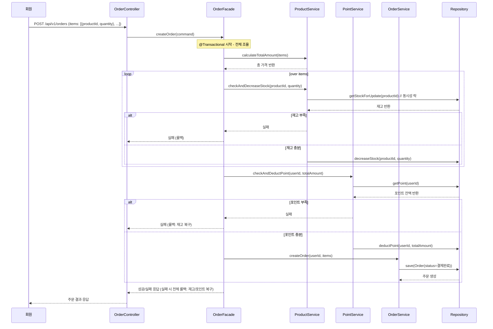

# 시퀀스 다이어그램

### 상품 좋아요 등록

```mermaid
sequenceDiagram
    participant User as 회원
    participant Controller as LikeController
    participant Service as LikeService
    participant LikeRepo as LikeRepository
    participant ProductRepo as ProductRepository

    User->>Controller: POST /api/v1/like/products/{productId}
    Controller->>Service: addLike(userId, productId)
    Service->>LikeRepo: existsByUserAndProduct(userId, productId)
    LikeRepo-->>Service: 존재 여부 반환 (이미 존재 시 무시 또는 에러)
    
    alt 존재하지 않음 (등록 가능)
        Service->>LikeRepo: save(Like(userId, productId))
        Service->>ProductRepo: incrementLikeCount(productId)
        ProductRepo-->>Service: 좋아요 수 증가
    end
    
    Service-->>Controller: 성공 응답 (멱등: 이미 등록 시 무시)
    Controller-->>User: 응답
```

### 상품 좋아요 해제

```mermaid
sequenceDiagram
    participant User as 회원
    participant Controller as LikeController
    participant Service as LikeService
    participant LikeRepo as LikeRepository
    participant ProductRepo as ProductRepository

    User->>Controller: DELETE /api/v1/like/products/{productId}
    Controller->>Service: removeLike(userId, productId)
    Service->>LikeRepo: existsByUserAndProduct(userId, productId)
    LikeRepo-->>Service: 존재 여부 반환 (없을 시 무시 또는 에러)
    
    alt 존재함 (취소 가능)
        Service->>LikeRepo: deleteByUserAndProduct(userId, productId)
        Service->>ProductRepo: decrementLikeCount(productId)
        ProductRepo-->>Service: 좋아요 수 감소
    end
    
    Service-->>Controller: 성공 응답 (멱등: 이미 취소 시 무시)
    Controller-->>User: 응답
```

### 주문 생성 및 결제 흐름

```mermaid
sequenceDiagram
    participant User as 회원
    participant Controller as OrderController
    participant Facade as OrderFacade
    participant ProductService as ProductService
    participant PointService as PointService
    participant OrderService as OrderService
    participant Repository as Repository

    User->>Controller: POST /api/v1/orders (items: [{productId, quantity}, ...])
    Controller->>Facade: createOrder(command)
    Note over Facade: @Transactional 시작 - 전체 조율
    Facade->>ProductService: calculateTotalAmount(items)
    ProductService-->>Facade: 총 가격 반환
    loop over items
        Facade->>ProductService: checkAndDecreaseStock(productId, quantity)
        ProductService->>Repository: getStockForUpdate(productId)  // 동시성 락
        Repository-->>ProductService: 재고 반환
        alt 재고 부족
            ProductService-->>Facade: 실패
            Facade-->>Controller: 실패 (롤백)
        else 재고 충분
            ProductService->>Repository: decreaseStock(productId, quantity)
        end
    end
    Facade->>PointService: checkAndDeductPoint(userId, totalAmount)
    PointService->>Repository: getPoint(userId)
    Repository-->>PointService: 포인트 잔액 반환
    alt 포인트 부족
        PointService-->>Facade: 실패
        Facade-->>Controller: 실패 (롤백: 재고 복구)
    else 포인트 충분
        PointService->>Repository: deductPoint(userId, totalAmount)
        Facade->>OrderService: createOrder(userId, items)
        OrderService->>Repository: save(Order(status=결제완료))
        Repository-->>OrderService: 주문 생성
    end
    Facade-->>Controller: 성공/실패 응답 (실패 시 전체 롤백: 재고/포인트 복구)
    Controller-->>User: 주문 결과 응답
```
