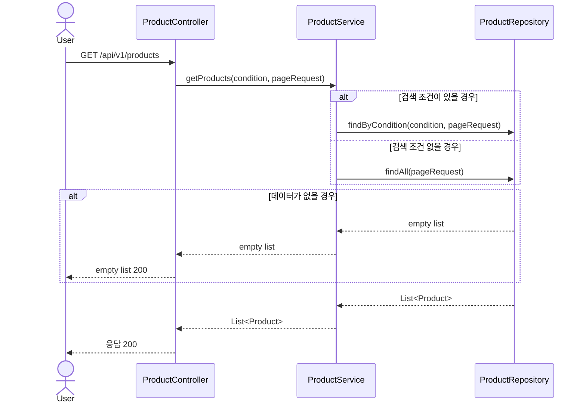
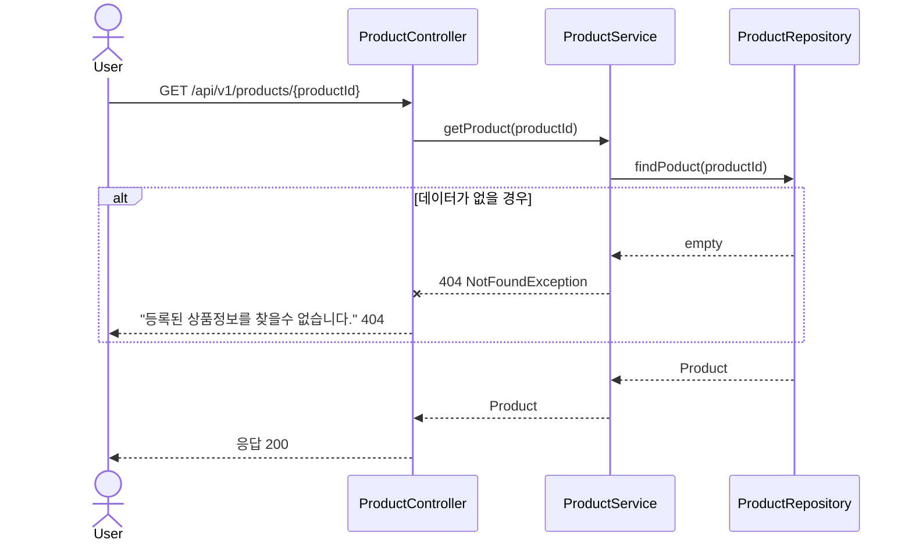
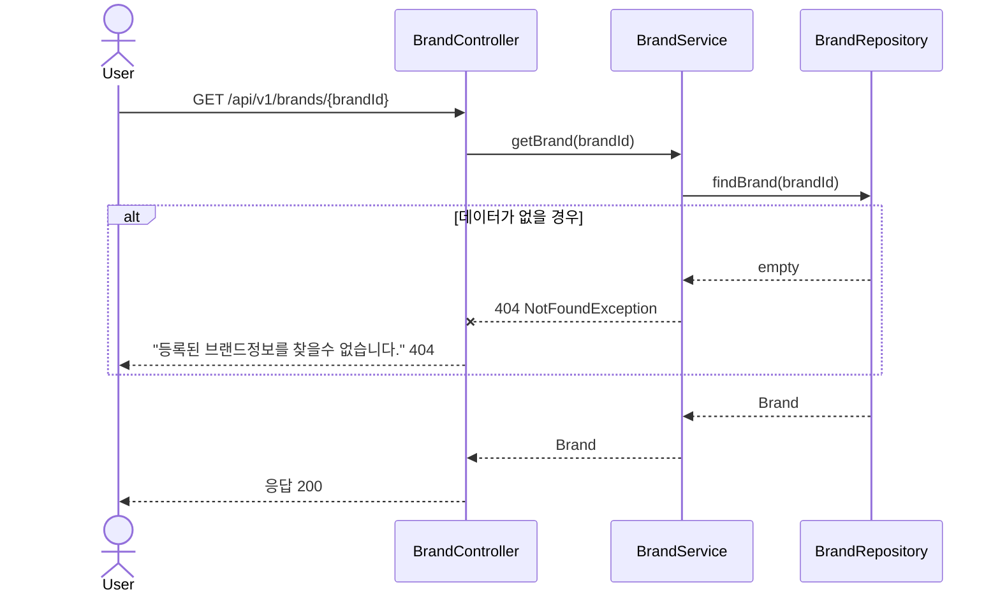
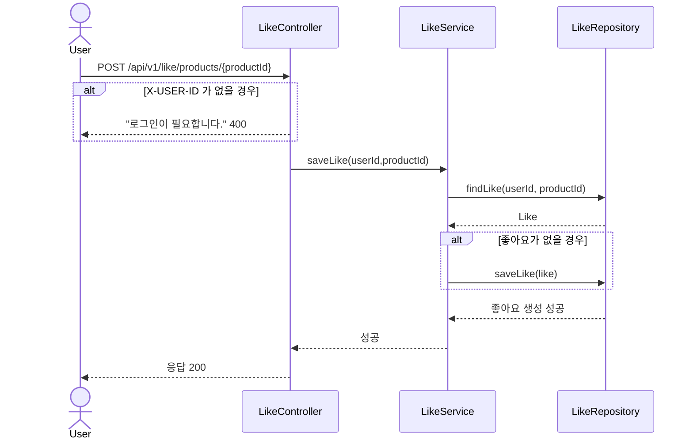
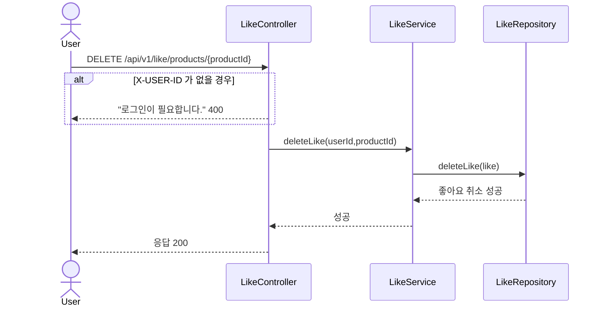
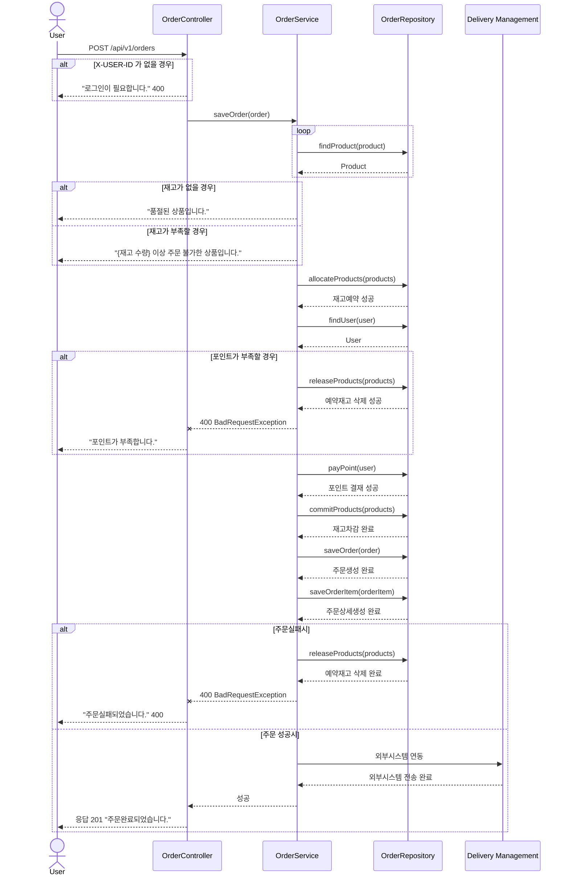

# 시퀀스 다이어그램 최소 2개 이상 (Mermaid 기반 작성 권장)

### 1.상품목록 조회

```mermaid
sequenceDiagram  
actor U as User  
participant C as ProductController  
participant S as ProductService  
participant R as ProductRepository  
U->>C: GET /api/v1/products  
C->>S: getProducts(condition, pageRequest)
alt 검색 조건이 있을 경우  
S->>R : findByCondition(condition, pageRequest)
else 검색 조건 없을 경우  
S->>R : findAll(pageRequest)
end alt 데이터가 없을 경우  
R-->>S: empty list  
S-->>C: empty list  
C-->>U: empty list 200  
end  
R-->>S: List<Product>  
S-->>C: List<Product>  
C-->>U: 응답 200
```

### 2.상품상세 조회

```mermaid
sequenceDiagram  
actor U as User  
participant C as ProductController  
participant S as ProductService  
participant R as ProductRepository  
U->>C: GET /api/v1/products/{productId}  
C->>S: getProduct(productId)
S->>R : findPoduct(productId)
alt 데이터가 없을 경우  
R-->>S: empty  
S--x C: 404 NotFoundException  
C-->>U: "등록된 상품정보를 찾을수 없습니다." 404  
end  
R-->>S: Product   
S-->>C: Product   
C-->>U: 응답 200
```

### 3.브랜드 조회

```mermaid
sequenceDiagram  
actor U as User  
participant C as BrandController  
participant S as BrandService  
participant R as BrandRepository  
U->>C: GET /api/v1/brands/{brandId}  
C->>S: getBrand(brandId)
S->>R : findBrand(brandId)
alt 데이터가 없을 경우  
R-->>S: empty  
S--x C: 404 NotFoundException  
C-->>U: "등록된 브랜드정보를 찾을수 없습니다." 404  
end  
R-->>S: Brand   
S-->>C: Brand   
C-->>U: 응답 200
```

### 4-1.좋아요 등록

```mermaid
sequenceDiagram  
actor U as User  
participant C as LikeController  
participant S as LikeService  
participant R as LikeRepository  
U->>C: POST /api/v1/like/products/{productId}  
alt X-USER-ID 가 없을 경우  
C-->>U: "로그인이 필요합니다." 400  
end  
C->>S: saveLike(userId,productId)
S->>R: findLike(userId, productId)
R-->>S: Like  
alt 좋아요가 없을 경우  
S->>R : saveLike(like)
end  
R-->>S: 좋아요 생성 성공   
S-->>C: 성공   
C-->>U: 응답 200
```

### 4-2.좋아요 취소

```mermaid
sequenceDiagram  
actor U as User  
participant C as LikeController  
participant S as LikeService  
participant R as LikeRepository  
U->>C: DELETE /api/v1/like/products/{productId}  
alt X-USER-ID 가 없을 경우  
C-->>U: "로그인이 필요합니다." 400  
end  
C->>S: deleteLike(userId,productId)
S->>R : deleteLike(like)  
R-->>S: 좋아요 취소 성공   
S-->>C: 성공   
C-->>U: 응답 200
```

### 5. 주문 생성 및 결재

```mermaid
sequenceDiagram  
actor U as User  
participant C as OrderController  
participant S as OrderService  
participant R as OrderRepository   
participant DLV as Delivery Management

U->>C: POST /api/v1/orders  
alt X-USER-ID 가 없을 경우  
C-->>U: "로그인이 필요합니다." 400  
end  
C->>S: saveOrder(order)
loop  
S->>R : findProduct(product)
R-->>S: Product  
end  
alt 재고가 없을 경우  
S-->>U: "품절된 상품입니다."
else 재고가 부족할 경우  
S-->>U: "{재고 수량} 이상 주문 불가한 상품입니다."
end  
S->>R: allocateProducts(products)
R-->>S: 재고예약 성공  
S->>R : findUser(user)
R-->>S: User  
alt 포인트가 부족할 경우  
S->>R: releaseProducts(products)
R-->>S: 예약재고 삭제 성공  
S--x C: 400 BadRequestException  
C-->>U: "포인트가 부족합니다."
end  
S->>R : payPoint(user)
R-->>S: 포인트 결재 성공  
S->>R : commitProducts(products)
R-->>S: 재고차감 완료  
S->>R : saveOrder(order)
R-->>S: 주문생성 완료  
S->>R : saveOrderItem(orderItem)
R-->>S: 주문상세생성 완료  
alt 주문실패시  
S->>R : releaseProducts(products)
R-->>S: 예약재고 삭제 완료  
S--x C: 400 BadRequestException  
C-->>U: "주문실패되었습니다." 400  
else 주문 성공시  
S->>DLV :외부시스템 연동  
DLV-->>S: 외부시스템 전송 완료  
S-->>C: 성공   
C-->>U: 응답 201 "주문완료되었습니다."
end
```