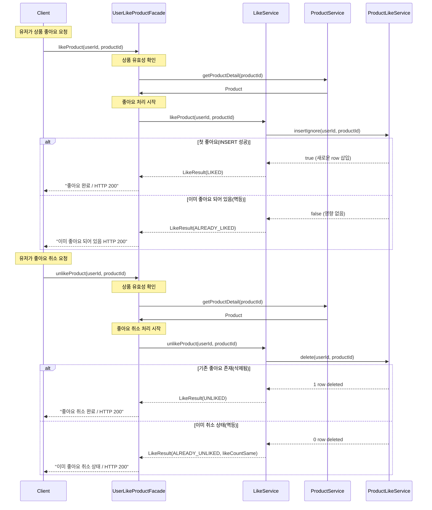
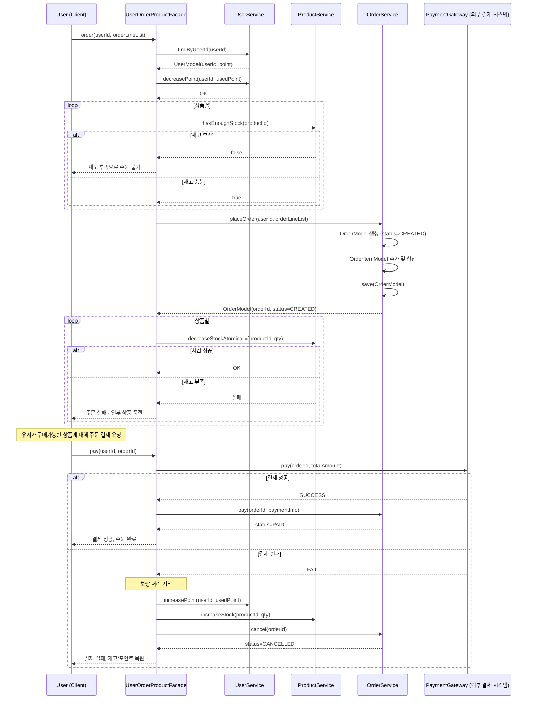

# 02-시퀀스 다이어그램

## 작업 목록
- [x] 1. 상품 좋아요 등록/취소 (멱등 동작)
- [] 2. 주문 생성 및 결제 흐름 (재고 차감, 포인트 차감, 외부 시스템 연동)

## 1. 상품 좋아요 등록/취소 시퀀스다이어그램
- 퍼사드 클래스와 그 하위 서비스들의 협력으로 풀어보려 하였습니다.

## 2. 주문 생성 및 결제 흐름 (재고 차감, 포인트 차감, 외부 시스템 연동)

- 현재는 유저가 장바구니 이동 / 선택한 상품 조회 / 결제 누르고 
- 반복하며 재고 확인 후 다시 결제 요청을 보내도록 함
- (고민) 유저가 장바구니로 이동 / 선택한 상품들 조회하려고 할때 재고상태를 미리 체크할 수도 있지 않을까?

