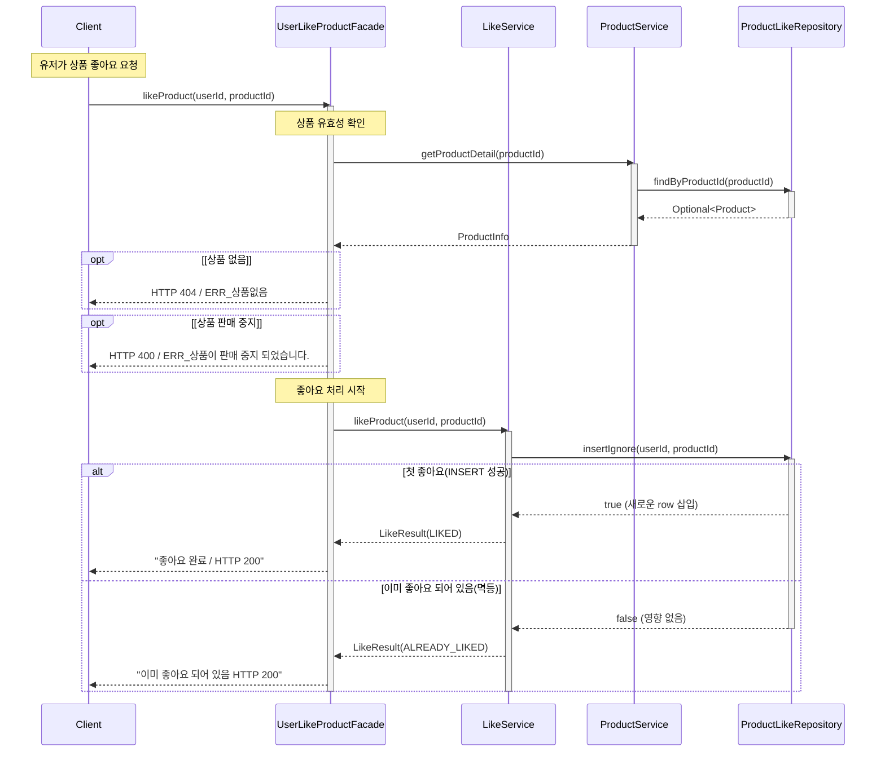
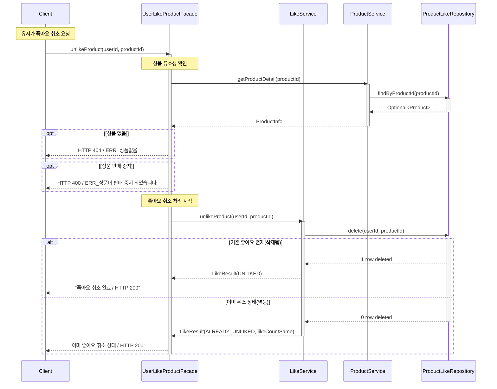
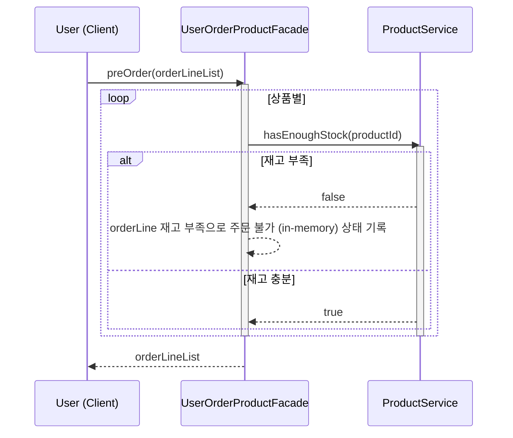
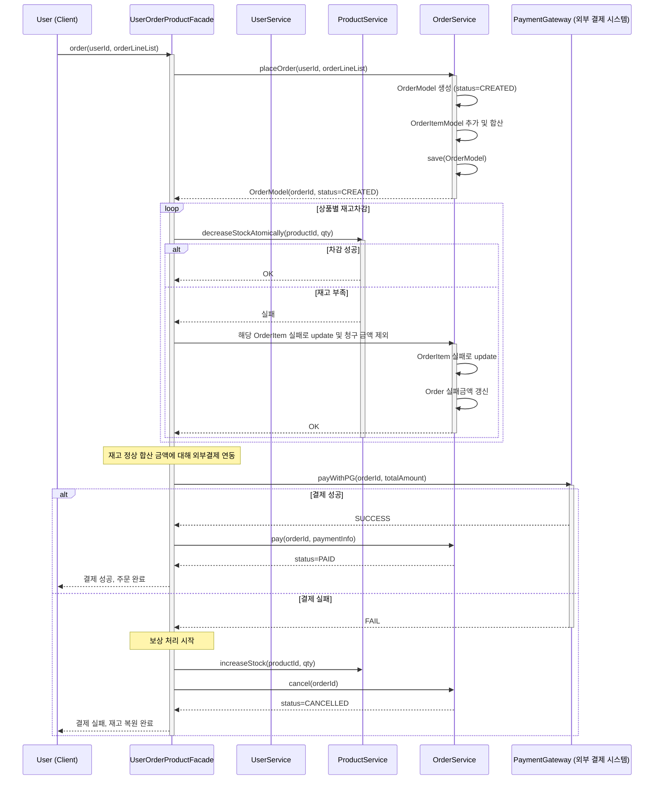
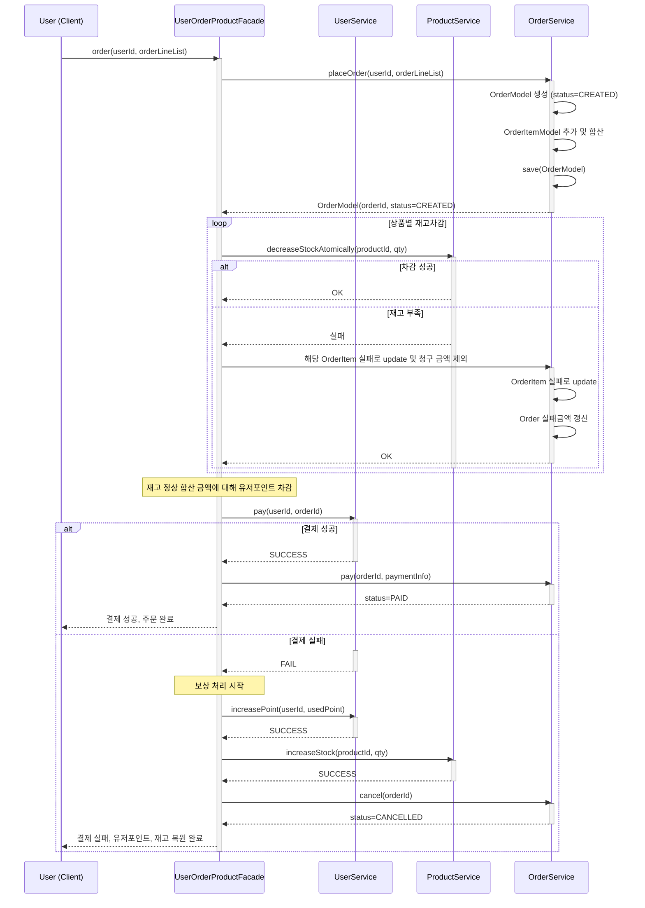

# 02-시퀀스 다이어그램

## 작업 목록
- [x] 1. 상품 좋아요 등록/취소 (멱등 동작)
- [] 2. 주문 생성 및 결제 흐름 (재고 차감, 포인트 차감, 외부 시스템 연동)

## 1. 상품 좋아요 등록/취소 시퀀스다이어그램
- 퍼사드 클래스와 그 하위 서비스들의 협력으로 풀어보려 하였습니다.

## 2. 상품 좋아요 취소 시퀀스 다이어그램

## 3. 주문 생성 전 재고 관련 선조회
- 1) 유저가 장바구니 이동
- 2) 선택한 상품 목록 조회시 재고 관련 선조회
- 3) 반복하며 재고 확인 결과 응답

## 4. 주문 생성 및 결제 흐름 (재고 차감, 외부 결제 시스템 연동)
- **유저는 확인한 재고 있는 상품에 대해 결제 요청 주문 송신**

## 5. 주문 생성 및 결제 흐름(내부 포인트로 결제)
- 내부결제 방식

