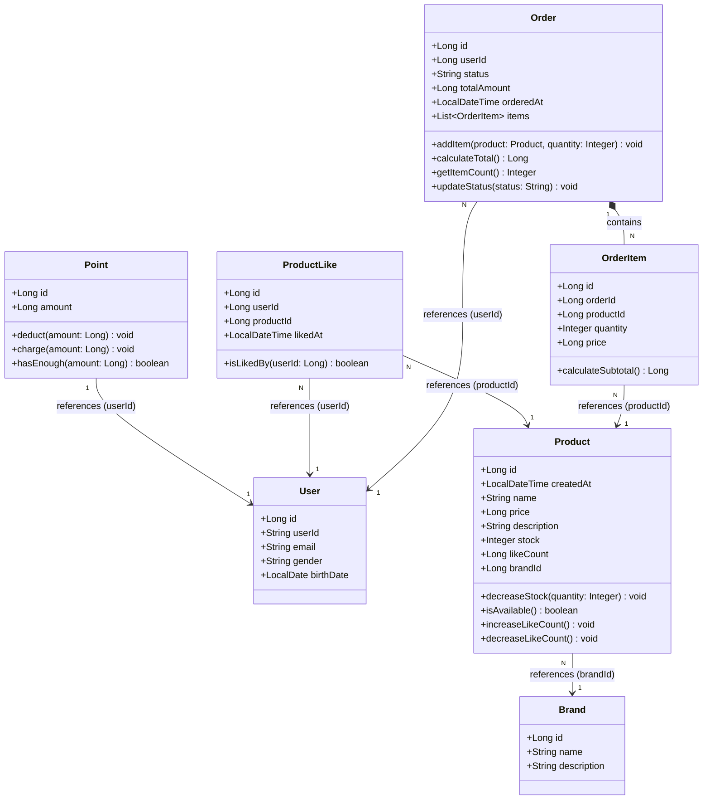

# 03-class-diagram.md - 클래스 다이어그램

## 📑 목차

- [1. 도메인 객체 설계](#1-도메인-객체-설계)
- [2. 도메인 설명](#2-도메인-설명)
  - [2.1 User (사용자)](#21-user-사용자)
  - [2.2 Point (포인트)](#22-point-포인트)
  - [2.3 Product (상품)](#23-product-상품)
  - [2.4 Brand (브랜드)](#24-brand-브랜드)
  - [2.5 ProductLike (좋아요)](#25-productlike-좋아요)
  - [2.6 Order (주문)](#26-order-주문)
  - [2.7 OrderItem (주문 항목)](#27-orderitem-주문-항목)
- [3. 관계 설명](#3-관계-설명)
- [4. 참고사항](#4-참고사항)

---

## 1. 도메인 객체 설계

## 2. 도메인 설명

### 2.1 User (사용자)
- 회원 정보를 담는 엔티티
- 좋아요와 주문의 주인
- ※ 1주차 구현 완료

### 2.2 Point (포인트)
- 사용자의 포인트 잔액
- User 1명당 Point 1개 (1:1 관계)
- **비즈니스 로직**:
  - `deduct()`: 포인트 차감 (부족 시 예외)
  - `charge()`: 포인트 충전
  - `hasEnough()`: 잔액 충분 여부 확인
- ※ 1주차 구현 완료

### 2.3 Product (상품)
- 판매 상품 정보
- 재고, 가격, 브랜드 정보를 가짐
- `likeCount`: 좋아요 수 (비정규화된 집계 값, 성능 최적화용)
- **비즈니스 로직**:
  - `decreaseStock()`: 재고 차감 (부족 시 예외)
  - `isAvailable()`: 판매 가능 여부 (재고 > 0)
  - `increaseLikeCount()`, `decreaseLikeCount()`: 좋아요 수 관리

### 2.4 Brand (브랜드)
- 브랜드 정보
- 여러 상품을 포함함

### 2.5 ProductLike (좋아요)
- 사용자가 상품에 누른 좋아요
- 한 상품당 한 번만 좋아요 가능 (중복 방지)
- `likedAt`: 좋아요 누른 시각 (최근 순 정렬용)
- **비즈니스 로직**:
  - `isLikedBy()`: 특정 사용자가 좋아요했는지 확인

### 2.6 Order (주문)
- 사용자의 주문 정보
- 여러 주문 항목(OrderItem)을 포함
- `status`: 주문 상태 (COMPLETED, PAYMENT_PENDING 등)
- `orderedAt`: 주문한 시각
- **비즈니스 로직**:
  - `addItem()`: 주문 항목 추가
  - `calculateTotal()`: 총 주문 금액 계산
  - `getItemCount()`: 주문 항목 수 조회
  - `updateStatus()`: 주문 상태 변경 (결제 실패 시 PAYMENT_PENDING으로 변경)

### 2.7 OrderItem (주문 항목)
- 주문에 포함된 개별 상품
- 주문 당시의 가격과 수량을 저장 (가격 변동 영향 없음)
- **Entity로 설계**: 독립 테이블로 관리되며 향후 확장 가능
- **비즈니스 로직**:
  - `calculateSubtotal()`: 항목 소계 (가격 × 수량)

## 3. 관계 설명

- **Point ↔ User**: 1:1 관계
- **Product → Brand**: 여러 상품이 하나의 브랜드 소속
- **ProductLike → User/Product**: 사용자가 상품에 좋아요
- **Order → User**: 사용자가 여러 주문 가능
- **Order → OrderItem**: 주문에 여러 상품 포함
- **OrderItem → Product**: 주문 항목이 상품 참조

## 4. 참고사항

- User, Point는 1주차에서 이미 구현됨 (관계 표현 위해 포함)
- **공통 필드** (BaseEntity 상속):
  - `id`: 엔티티 식별자 (Long)
  - `createdAt`: 생성 일시
  - `updatedAt`: 수정 일시
  - `deletedAt`: 삭제 일시 (Soft Delete용)
