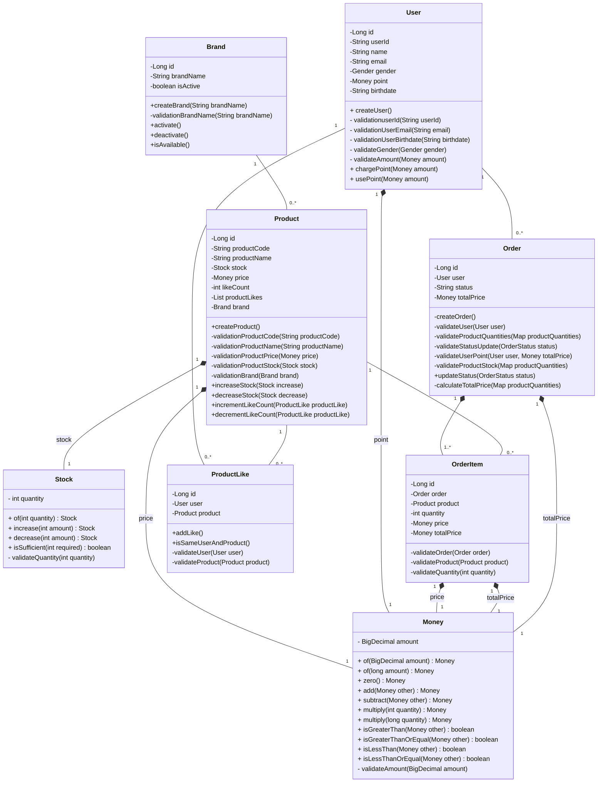

### E-Commerce 플랫폼 도메인 클래스 다이어그램

### 클래스 다이어그램 설명

*   **Product**: 상품의 기본 정보와 재고, 좋아요 수를 포함합니다.
*   **Brand**: 상품이 속한 브랜드 정보를 나타냅니다.
*   **User**: 시스템을 이용하는 사용자의 기본 정보와 포인트를 포함합니다.
*   **Order**: 사용자의 주문 정보를 나타냅니다.
*   **OrderItem**: 주문 내역에 포함된 개별 상품의 정보를 나타냅니다. `Order`와 `Product` 간의 N:M 관계를 해소하는 중간 엔티티 역할을 합니다.
*   **ProductLike**: 사용자가 특정 상품에 '좋아요'를 표시한 관계를 나타냅니다. `User`와 `Product` 간의 N:M 관계를 해소하는 중간 엔티티 역할을 합니다.