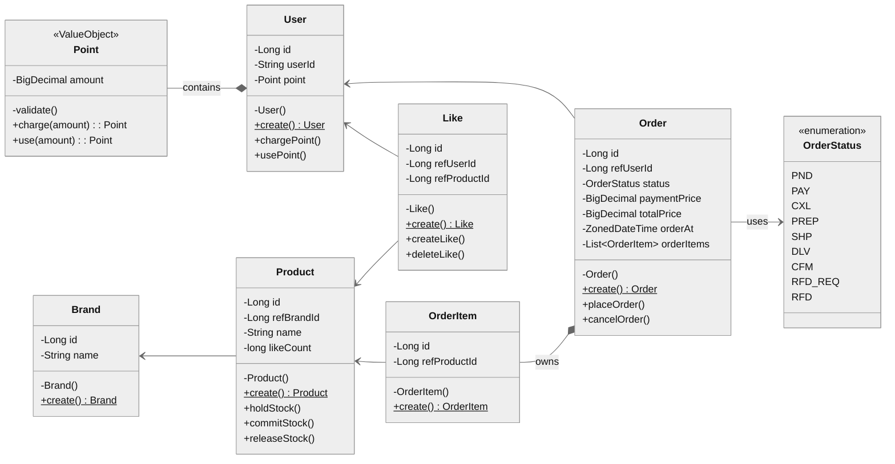

```mermaid
---
title:도메인 객체 설계 (클래스 다이어그램)
---
%%{init: {'theme': 'neutral'}}%%   
classDiagram  
direction RL  
class User {  
-Long id  
-String userId  
-Point point  
-User()
+create()$ User  
+chargePoint()
+usePoint()
}  
class Product {  
-Long id  
-Long refBrandId  
-String name  
-long likeCount  
-Product()
+create()$ Product  
+holdStock()  
+commitStock()  
+releaseStock()  
}  
class Brand {  
-Long id  
-String name  
-Brand()
+create()$ Brand }  
class Like {  
-Long id  
-Long refUserId  
-Long refProductId  
-Like()
+create()$ Like  
+createLike()
+deleteLike()
}  
class Order {  
-Long id  
-Long refUserId  
-OrderStatus status  
-BigDecimal paymentPrice  
-BigDecimal totalPrice  
-ZonedDateTime orderAt  
-List~OrderItem~ orderItems  
-Order()
+create()$ Order  
+placeOrder()
+cancelOrder()
}  
class OrderItem {  
-Long id  
-Long refProductId  
-OrderItem()
+create()$ OrderItem }  
class Point {
<<ValueObject>>
-BigDecimal amount  
-validate()
+charge(amount): Point  
+use(amount): Point  
}  
class OrderStatus {
<<enumeration>>  
PND  
PAY  
CXL  
PREP  
SHP  
DLV  
CFM  
RFD_REQ  
RFD  
}  
Order --> User  
Like --> Product  
Like --> User

Order *-- OrderItem  : owns  
Product --> Brand  
OrderItem --> Product  
User *--Point : contains  
OrderStatus <-- Order : uses

```