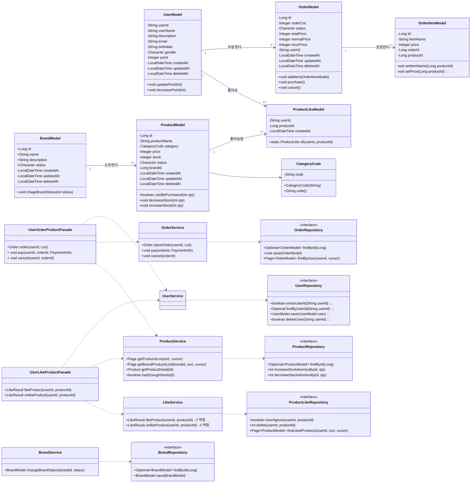
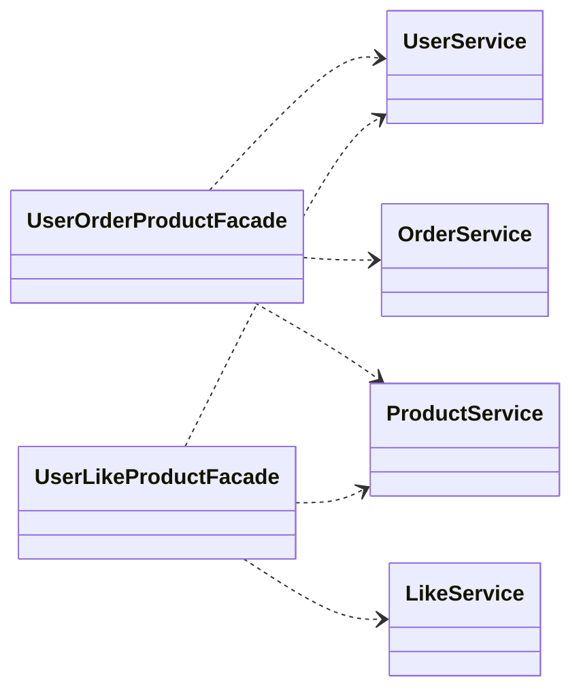

## 03 - 클래스 다이어그램

### 클래스 다이어그램



### 기타
#### update로 메소드를 퉁치기 vs increase()/decrease() 역할 나눠주기
> 입력값 검증 등이 다를 수 있기도 하고 명확하게 추적할 수 있으면 좋을 것 같아서 메소드 역할은 하나의 동작만한다는 원칙을 가져가는게 좋아보였습니다.

e.g) UserModel에선 포인트는 충전은 updatePoint로 하고 있는데, 현재 포인트 차감은 없음. 클래스 다이어그램엔 그리고 3주차에 수정
```
public void updatePoint(Integer newPoint) {
        validateChargePoint(newPoint);
        this.point +=  newPoint;
    }
```

#### 기본적인 엔티티, 레파지토리, 서비스 객체간 역할과 책임에 대해 고민

#### 퍼사드 계층으로, 핵심 로직인 유저의 상품 주문 / 유저의 상품 좋아요를 구분하려함

