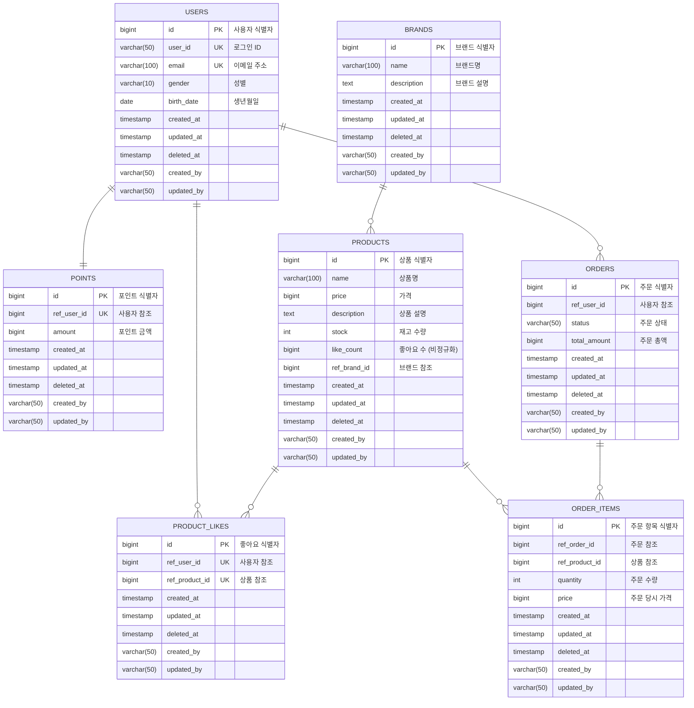

# 04-erd.md - ERD 설계

## 📑 목차

- [1. 데이터베이스 테이블 구조](#1-데이터베이스-테이블-구조)
- [2. 테이블 설명](#2-테이블-설명)
  - [2.1 USERS](#21-users)
  - [2.2 POINTS](#22-points)
  - [2.3 BRANDS](#23-brands)
  - [2.4 PRODUCTS](#24-products)
  - [2.5 PRODUCT_LIKES](#25-product_likes)
  - [2.6 ORDERS](#26-orders)
  - [2.7 ORDER_ITEMS](#27-order_items)
- [3. 공통 필드](#3-공통-필드)

---

## 1. 데이터베이스 테이블 구조

## 2. 테이블 설명

### 2.1 USERS
- 사용자 계정 정보
- user_id, email 유니크 제약

### 2.2 POINTS
- 포인트 잔액
- User와 1:1 관계

### 2.3 BRANDS
- 브랜드 정보
- 사전 등록 데이터

### 2.4 PRODUCTS
- 판매 상품 정보
- 재고 관리 (stock)
- 좋아요 수 비정규화 (like_count)
  - 성능 최적화: 매번 COUNT(*) 대신 미리 계산된 값 저장
  - 좋아요 추가/삭제 시 트랜잭션으로 업데이트
- 사전 등록 데이터

### 2.5 PRODUCT_LIKES
- 상품 좋아요
- **제약조건**:
  - PRIMARY KEY: id
  - UNIQUE KEY: (ref_user_id, ref_product_id)
    - 한 사용자가 동일 상품에 중복 좋아요 방지
    - 멱등성 보장을 위한 비즈니스 규칙

### 2.6 ORDERS
- 주문 정보
- total_amount는 OrderItem 합계
- **status**: 주문 상태
  - `COMPLETED`: 결제 완료
  - `PAYMENT_PENDING`: 결제 대기 (결제 처리 실패 시)

### 2.7 ORDER_ITEMS
- 주문 상품 상세
- 주문 당시 가격 저장

## 3. 공통 필드

모든 테이블은 다음 공통 필드를 포함합니다:

| 필드명 | 타입 | 설명 |
|--------|------|------|
| created_at | timestamp | 생성 일시 |
| updated_at | timestamp | 수정 일시 |
| deleted_at | timestamp | 삭제 일시 (Soft Delete) |
| created_by | varchar(50) | 생성자 |
| updated_by | varchar(50) | 수정자 |
