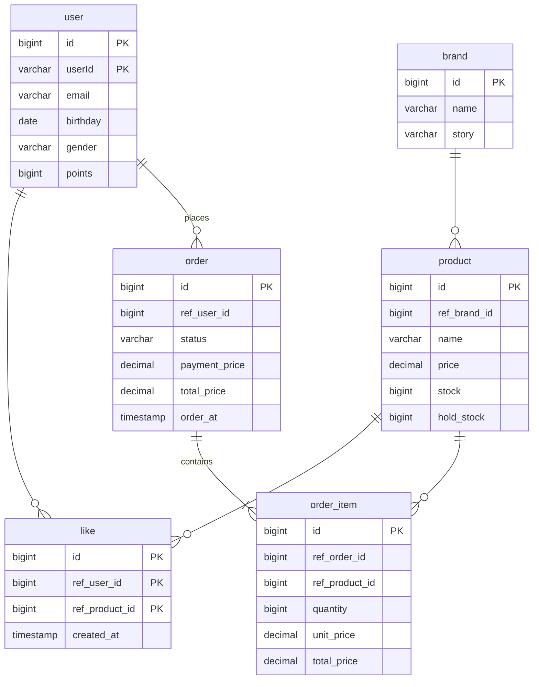

# 전체 테이블 구조 및 관계 정리 (ERD Mermaid 작성 가능)

```mermaid
erDiagram  
user {  
bigint id PK  
varchar userId PK    
varchar email  
date birthday  
varchar gender  
bigint points  
}  
product {  
bigint id PK  
bigint ref_brand_id  
varchar name  
decimal price  
bigint stock  
bigint hold_stock  
}  
brand {  
bigint id PK  
varchar name  
varchar story  
}  
like {  
bigint id PK  
bigint ref_user_id PK   
bigint ref_product_id PK  
timestamp created_at  
}  
order {    
bigint id PK  
bigint ref_user_id  
varchar status  
decimal payment_price  
decimal total_price  
timestamp order_at   
}  
order_item {    
bigint id PK    
bigint ref_order_id  
bigint ref_product_id  
bigint quantity  
decimal unit_price  
decimal total_price  
}  
product ||--o{ like : ""  
user ||--o{ like : ""  
brand ||--o{ product : ""  
user ||--o{ order : "places"  
order ||--|{ order_item : contains  
product ||--o{ order_item :""
```