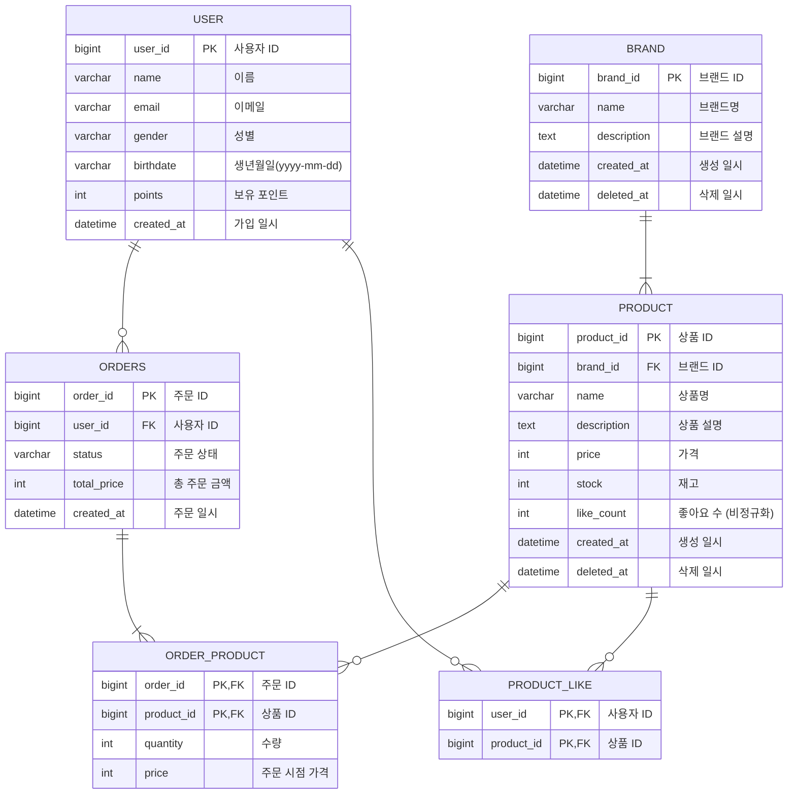

### E-Commerce 플랫폼 ERD

```mermaid
erDiagram
    USER {
        bigint user_id PK "사용자 ID"
        varchar name "이름"
        varchar email "이메일"
        varchar gender "성별"
        varchar birthdate "생년월일(yyyy-mm-dd)"
        int points "보유 포인트"
        datetime created_at "가입 일시"
    }
    ORDERS {
        bigint order_id PK "주문 ID"
        bigint user_id FK "사용자 ID"
        varchar status "주문 상태"
        int total_price "총 주문 금액"
        datetime created_at "주문 일시"
    }
    ORDER_PRODUCT {
        bigint order_id PK, FK "주문 ID"
        bigint product_id PK, FK "상품 ID"
        int quantity "수량"
        int price "주문 시점 가격"
    }
    PRODUCT {
        bigint product_id PK "상품 ID"
        bigint brand_id FK "브랜드 ID"
        varchar name "상품명"
        text description "상품 설명"
        int price "가격"
        int stock "재고"
        int like_count "좋아요 수 (비정규화)"
        datetime created_at "생성 일시"
        datetime deleted_at "삭제 일시"
    }
    PRODUCT_LIKE {
        bigint user_id PK, FK "사용자 ID"
        bigint product_id PK, FK "상품 ID"
    }
    BRAND {
        bigint brand_id PK "브랜드 ID"
        varchar name "브랜드명"
        text description "브랜드 설명"
        datetime created_at "생성 일시"
        datetime deleted_at "삭제 일시"
    }

    USER ||--o{ ORDERS : ""
    USER ||--o{ PRODUCT_LIKE : ""

    PRODUCT ||--o{ ORDER_PRODUCT : ""
    PRODUCT ||--o{ PRODUCT_LIKE : ""
    
    ORDERS ||--|{ ORDER_PRODUCT : ""

    BRAND ||--|{ PRODUCT : ""
```