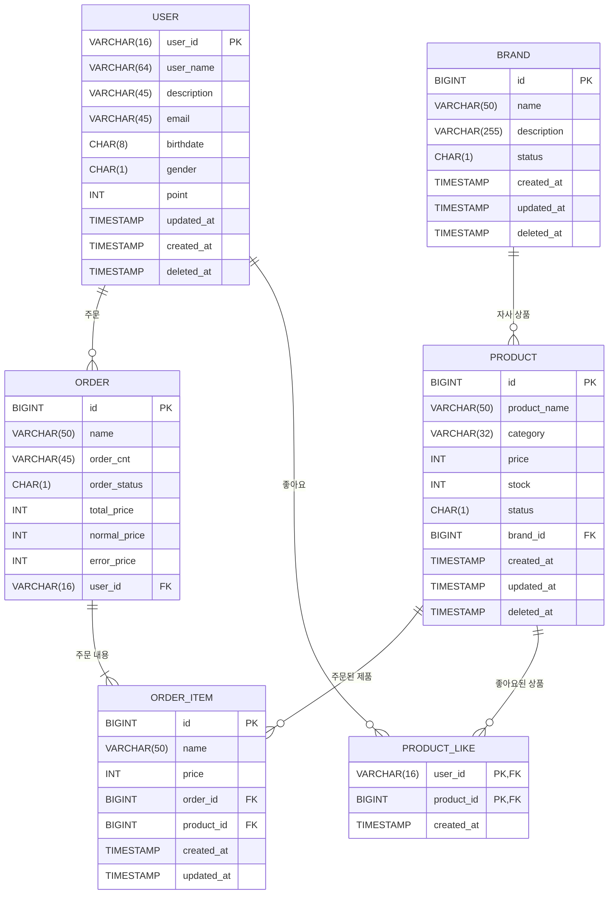

## 04-ERD
### 작업 내용 
> 유저, 브랜드, 상품, 주문, 주문_상품, 좋아요 테이블을 구성
### ERD 설계 고민사항 
- 좋아요의 멱등성을 보장하기 위해, {이용자ID, 상품_id} 에 대해 INSERT, DELETE 되도록 설계 
- N:M 관계 해소, 과제를 위한 핵심적인 필드만 담으려고 하였습니다.
- Audit 관련 컬럼 추가

#### Order (주문)
- 여러 주문상품에 대한 하나의 주문id로
- 여러 주문상품에 대한 총 건수, 총 금액, 정상 처리 금액, 처리가 안된건은 에러 금액으로 관리

#### order_item (주문 상품)
- 상품과 N:1 관계를 맺으며 주문한 상품에 대한 참조키와 기본적인 상품 이름, 결제금액을 관리

#### Brand / Product
- soft delete 을 고려하였습니다.
- Product의 경우 재고량, 원가 정보등을 담습니다.

